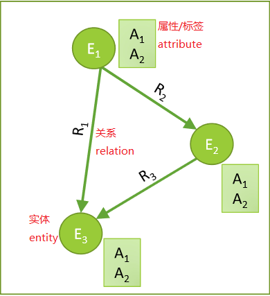
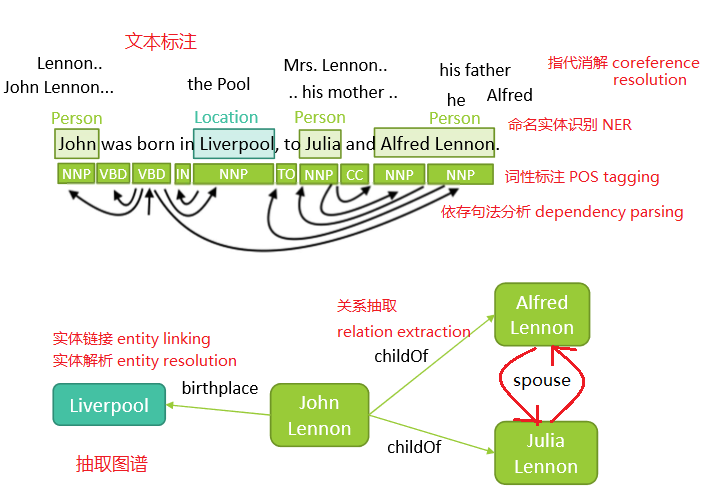
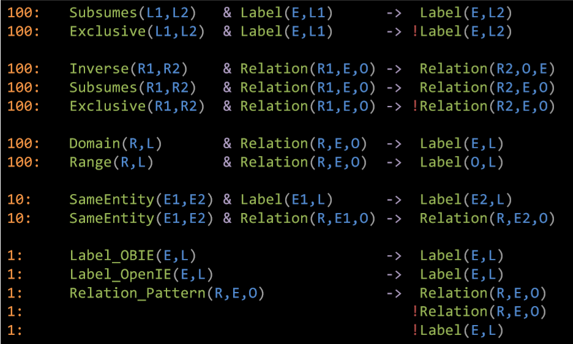
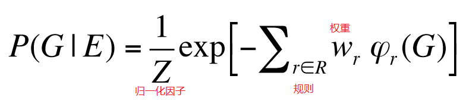
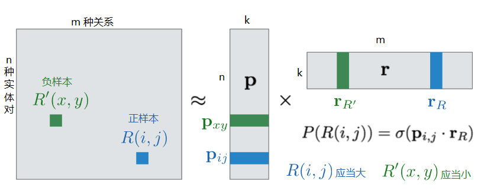
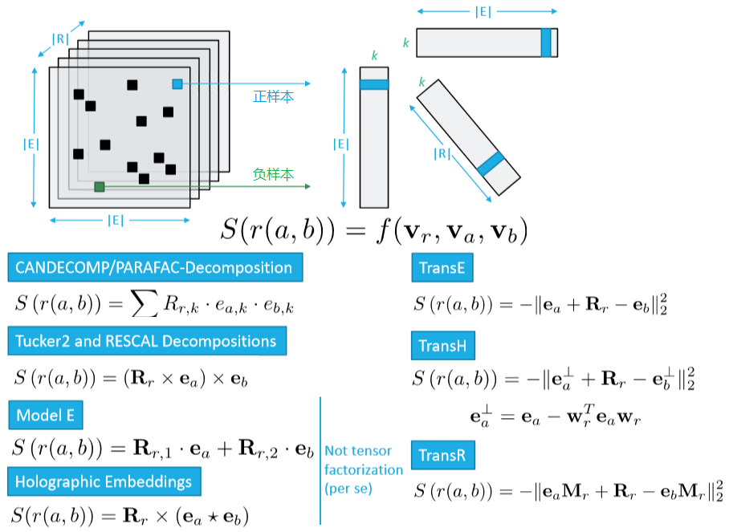

WSDM 2018 知识图谱 tutorial，标题为 Mining Knowledge Graphs from Text，从文本挖掘知识图谱。主讲人是 Jay Pujara 和 Sameer Sigh。本文参考 slides 整理而成。

> Slides 下载见 https://kgtutorial.github.io/ 

## 初步认识知识图谱

知识图谱，Knowledge Graph，缩写为 KG。

### 什么是知识图谱？

知识（knowledge）表示为图（graph）的形式，刻画了实体（entity）、实体属性（attribute，有时也称为标签）、实体之间的二元关系（relation 或 relationship）。在图中，实体为顶点，关系为具有类型和方向的边。

<figure>
  
  <figcaption>知识图谱的实体、属性、关系</figcaption>
</figure>

> 严格来说，知识图谱既然是 graph，就不应该翻译为图谱，而应该翻译为图。但是知识图谱、社交图谱等说法已经深入人心。

### 知识图谱从哪里来？

过去主要是来源于结构化文本、非结构化文本，现在也关注图像、视频等多模态的来源。

### 有哪些数据集？

这里只列举其中一部分。

知识图谱数据集

- FB15K-237：基于 Freebase 的知识库补全数据集
- DBPedia：维基百科抽取出的结构化数据
- NELL (Never-Ending Language Learner)：从网络自学习的知识库
- AristoKB：科学领域的知识库

文本数据集

- Clueweb09：10亿网页
- FACC1：对 Clueweb09 语料的 Freebase 标注
- Gigaword：句法和语篇结构 
- NYTimes：纽约时报标注语料库

### 知识图谱如何表示？

现在主流的是 RDF 三元组：`<rdf:subject, rdf:predicate, rdf:object>`，或 r(s, p, o)。
所谓 RDF，即 Resource Description Framework，是一种描述数据的框架。一个 RDF 三元组 r(s, p, o) 可以描述一个实体 s 的属性 p 的值为 o，或者一个实体 s 和一个实体 o 具有关系 p。在图中，记为从顶点 s 指向顶点 o 的一条类型为 p 的有向边。

语义网（Semantic Web）和本体（ontology）的 RDFS 和 OWL 体系内容繁多，建议查阅其他资料。

### 构建知识图谱有哪些困难和问题，如何解决？

根本困难是知识获取存在瓶颈，不可能实现完全人工标注。

基本问题有三个：实体（顶点）是谁？实体的属性和类型（标签）是什么？实体的关系（边）是怎样的？

大体分为两方面解决，第一步从文本抽取出知识，然后进一步构建出知识图谱。

<table border="0">
<tr>
	<td></td>
	<td>知识抽取（从文本到抽取图谱）</td>
	<td>图谱构建（从抽取图谱到知识图谱）</td>
</tr>
<tr>
	<td>实体（顶点）是谁？</td>
	<td>
	命名实体识别/named entity recoginition，
	实体指代消解/entity coreference   
	</td>
	<td>
	实体链接/entity linking，
	实体解析/entity resolution  
	</td>
</tr>
<tr>
	<td>实体的属性和类型（标签）是什么？</td>
	<td>实体类型推断/entity typing</td>
	<td>集体分类/collective classification</td>
</tr>
<tr>
	<td>实体的关系（边）是怎样的？	</td>
	<td>语义角色标注/semantic role labeling，
	关系抽取/relation extraction</td>
	<td>链接预测/link prediction</td>
</tr>
</table>

## 知识抽取

### 如何从文本中抽取出知识？

传统的自然语言处理方法，首先进行词性标注，名词倾向于构成实体，动词倾向于构成关系；进行命名实体标注，识别实体指称和实体类型；进行依存句法分析，将以上内容相结合构成文本特征，用人工或机器学习方法定义出抽取规则。

初步抽取出候选项之后，进行文档内的指代消解，实体解析和链接，解决同一实体多名、多种实体同名的问题。

<figure>
  
  <figcaption>知识抽取</figcaption>
</figure>

### 抽取过程有哪些问题，如何解决？

具体问题有三个：定义领域，学习抽取器，打分。

解决方法按照监督方式不同，分为三个层次：有监督，半监督，无监督。

有监督方法标注代价高，无监督方法有语义漂移等缺点，半监督方法是两者之间的折中。

<table border="0">
<tr>
	<td></td>
	<td>有监督</td>
	<td>半监督</td>
	<td>无监督</td>
</tr>
<tr>
	<td>定义领域</td>
	<td>人工标注</td>
	<td>人工定义一部分类型；从无标注数据半监督学习扩展新类型</td>
	<td>名词性短语都是候选实体；动词性短语都是候选关系</td>
</tr>
<tr>
	<td>学习抽取器</td>
	<td>精确的模式</td>
	<td>通过 bootstrap 方法学习模式</td>
	<td>有约束的短语聚类</td>
</tr>
<tr>
	<td>打分</td>
	<td>人工定义打分，或从大量训练数据机器学习打分函数</td>
	<td>利用有标签和无标签数据，多轮迭代，改进打分函数</td>
	<td>自训练；抽取模式的置信度基于能抽取的不同实例个数，候选事实的分数基于它符合的不同抽取模式个数</td>
</tr>
</table>

## 图谱构建

### 为什么抽取图谱不能直接作为知识图谱？

抽取出的知识有种种问题：不精确（自然语言固有问题），不完整（信息源无法面面俱到），不一致（知识本身会变化）。

需要对抽取图谱进行清洗和补全，整合本体约束和关系模式，发现知识图谱内部的统计关系。

### 图谱构建的方法有哪些？

有两大类方法，分别是概率模型和基于嵌入式模型的方法。

概率模型又分为图模型和随机游走方法。

### 概率模型

#### 所谓概率模型，概率从哪里来？

在图上定义联合概率分布 P(Who, What, How | Extractions)，即 P(实体, 属性, 关系 | 抽取)。利用图中事实之间的依存关系，定义联合概率（条件概率、转移概率）。

概率的决定方式有三种：文本抽取器和分类器提供的统计信号；领域的本体知识；从数据中挖掘出的规则和模式。

#### 在图模型中，怎样计算概率？

在知识图谱领域，主要见到的是基于规则的图模型。

<figure>
  
  <figcaption>知识图谱的基本规则</figcaption>
</figure>

对每一条规则，将公式中的变量代换为抽取图中的内容，可以计算出满足值（satisfaction）。加权求和，然后归一化，就得到以抽取图为条件的联合概率分布。

<figure>
  
  <figcaption>知识图谱的概率图模型</figcaption>
</figure>

进行最大后验估计，主要有两类方法：

- MLN，即 Markov Logic Network，数值是离散的布尔值，方法是蒙特卡洛采样
- PSL，即 Probabilistic Soft Logic，数值是连续的，方法是凸优化

#### 在随机游走方法中，怎样计算概率？

给定一个关于某实体和某关系的查询（query），从该实体出发，在知识图谱上随机游走，直到抵达合适的目标时终止，输出目标状态的概率。

学习参数决定随机游走中的选择。

近年来比较重要的随机游走方法也有两类：

- PRA：即 Path Ranking Algorithm，在不完全知识图谱上进行随机游走，用动态规划估计转移概率，用逻辑回归学习路径的权重参数
- ProPPR：即 Programming with Personalized PageRank，构造以 partially-ground clauses 为顶点、以变换规则为边的证明图（proof graph），用随机梯度下降法学习随机游走的权重

> 例如，在知识图谱中，John Lennon 是顶点，ChildOf 是边。在 ProPPR 中，如果查询 R(John Lennon, HasNationality, ?)，那么构造证明图，R(John Lennon, ChildOf, X), R(X, HasNationality, Y) 是一个顶点。具体知识可以查阅知识图谱、推荐系统相关文献。

### 嵌入式模型

#### 为何在知识图谱中引入嵌入式模型？

概率模型中，所刻画的关系类型受到限制，需要人工定义规则，难以推广到新实体、新关系，而且其学习和查询通常是 NP 难的，计算复杂度很高，难以利用 GPU 或并行计算。

所谓嵌入式模型，是指将所有对象映射到低维空间，表示为稠密实数向量。
基于嵌入式表示的模型，能刻画多种关系，由数据学习而来，容易推广到新的实体和关系，用反向传播算法、随机梯度下降法可以高效学习，查询的计算成本通常很低，容易利用 GPU 并行计算。

嵌入式模型构建图谱，主要包含两个相互关联的任务：一是关系抽取，将表层模式提炼为关系；二是图谱补全或链接预测，没有直接抽取出来的关系也可以通过推断补充完整。其关键问题是对实体、关系进行嵌入式表示。

#### 嵌入式模型如何进行关系抽取？

关系抽取可以利用远程监督（distant supervision）方法，将语料对齐，若同一对实体共现多次，假定每次共现都描述同一种关系。利用这种监督信息，可以训练出关系抽取器。

利用嵌入式模型，远程监督关系抽取可以转化为矩阵分解问题。将每一个实体对、每一种关系都表示为一个 k 维向量，分解实体对与关系的共现矩阵。利用负采样，使正样本得分尽量高，负样本得分尽量低，用梯度下降法、反向传播训练出实体对、关系的向量表示。

<figure>
  
  <figcaption>基于矩阵分解的关系抽取</figcaption>
</figure>

这里，得分可以用向量相似度表示，例如余弦相似度。没有出现在样本中的实体对-关系二元组都可能作为负样本。这一点与链接预测问题是不同的。

> Universal Schema, Riedel et al, NAACL (2013)

#### 嵌入式模型如何进行图谱补全？

与关系抽取可以采用相同的思路，只是从实体对-关系的二元组变成了实体-关系-实体的三元组，因此不再是矩阵分解，而是张量分解。依然可以使用负采样和梯度下降法。

<figure>
  
  <figcaption>基于张量分解的图谱补全</figcaption>
</figure>

在二元组中，两个向量的相似度容易定义。三元组中，三个向量的得分函数则有多种可能形式，也是许多研究的关注点和创新点。不过一般来说，都是基于向量本身或经过某种变换后的空间距离。

