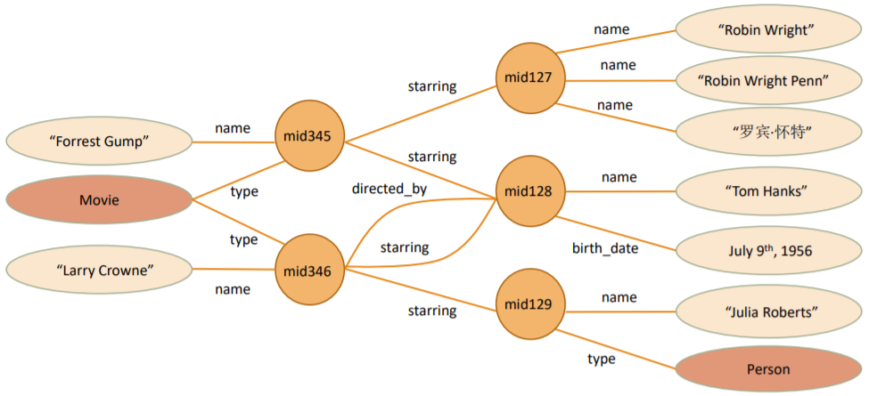
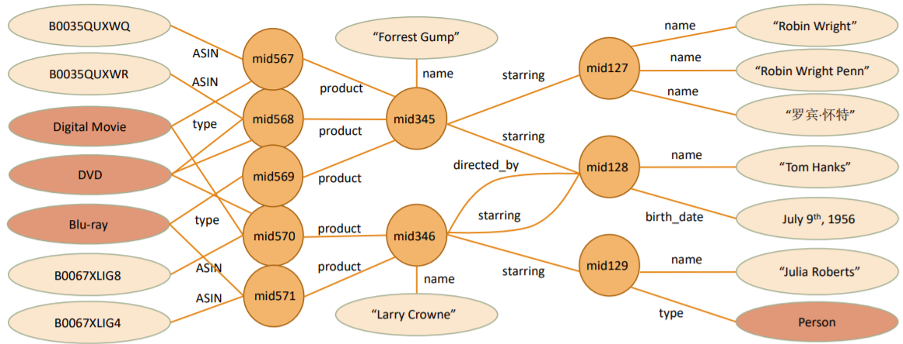
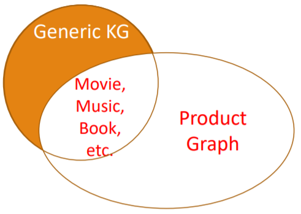
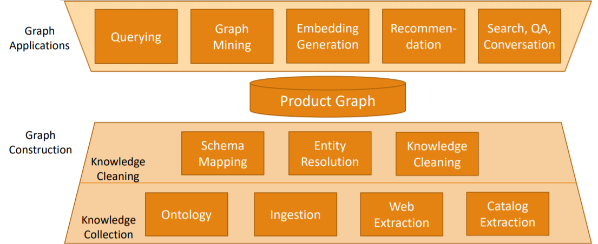
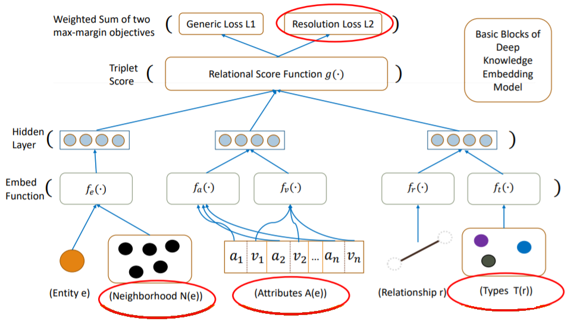

查找产品知识图谱相关资料时，看到
Xin Luna Dong 在 KBCOM 2018、SigKDD 2018 等会议上的演讲 *Challenges and Innovations in Building a Product Knowledge Graph*。她总结了主持建立 Amazon 产品知识图谱的实战经验，分享了许多有益的思考，这份 slides 值得阅读。本文以问答形式简单整理一份笔记，截图均出自原 slides。

> Slides 可在 http://kbcom.org/speaker_slides/ProductGraph_KBCOM.pdf 获取；也可访问Xin Luna Dong 的个人主页 http://lunadong.com/

## 产品图谱与知识图谱有什么关系？

知识图谱我们已经很熟悉，是以实体为顶点、关系为边构成的有向图，实体具有实体类型。知识图谱在搜索引擎、个人助理等领域用途很大。

产品图谱的使命是回答关于产品和相关知识的一切问题。

<figure>
  
  <figcaption>电影知识图谱</figcaption>
</figure>

<figure>
  
  <figcaption>电影产品图谱</figcaption>
</figure>

产品图谱和通用图谱不是互相包含的关系，但是两者在影视、音乐、图书等领域有部分重合。

<figure>
  
  <figcaption>知识图谱与产品图谱的关系</figcaption>
</figure>

## 建立产品图谱有哪些困难之处？

- 没有直接可以获取产品知识的数据源
	- Wikipedia 对产品没太大帮助
	- 大量结构化的数据埋没在产品目录的文字描述中
	- 卖家敷衍填写信息，数据噪声大
- 每天新增大量产品
	- 爬不完，筛不动
	- 信息新鲜度有挑战
- 大量产品类别
	- 人工定义本体，繁琐
	- 难以把握新产品类别和性质的动向
- 大量实体并不是命名实体
	- 命名实体识别不好用
	- 抽取、链接、搜索有挑战

## 如何建立产品图谱

产品相关的知识从哪里来？Amazon，万维网，结构化数据。

整个产品图谱架构分为图谱构建和图谱应用两大块。图谱构建部分又分为知识收集、知识清洗两部分。

<figure>
  
  <figcaption>产品图谱架构</figcaption>
</figure>

## 选择什么机器学习模型？

从结构化数据源整合知识：实体链接（实体解析），算法采用 attribute-wise 相似度的随机森林。

从网络上的半结构化数据抽取知识：远程监督 DOM 抽取，算法采用 logistic regression。
> 相关工作发表在 CERES: Distantly Supervised Relation Extraction from the Semi-Structured Web https://arxiv.org/abs/1804.04635

从 Amazon 自有目录的产品简介出发，构建浅层图谱：开放属性抽取（命名实体识别)，算法采用 BiLSTM+CRF+Attention。

图谱挖掘与嵌入：深度知识模型。

<figure>
  
  <figcaption>深度知识模型</figcaption>
</figure>

