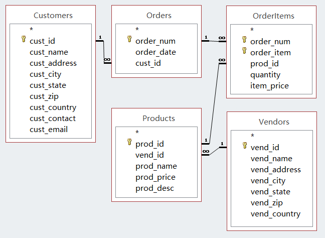

本文主要参考 *Sams Teach Yourself SQL in 10 Minutes* 第四版，作者 Ben Forta，中文版书名为《SQL 必知必会》。

# 数据库简介

> 原书第 1 课及第 21 课的部分内容。

SQL 可以读作 S-Q-L 三个字母，也可以读成 sequel 这个英文词。SQL 是一种对数据库进行操作的语言。常见的 Microsoft Access、MySQL 等不是 SQL 语言，而是数据库管理系统（缩写为 DBMS）。语言和软件，两者不要混淆。

标准 SQL 即 ANSI SQL，每种 DBMS 软件都有其特有的 SQL 语法和特性，建议随时查阅文档。

SQL 语句不区分大小写，也不关心换行。建议养成良好的编码习惯，关键字用大写字母，并在适当位置换行。

数据库（database）、表(table)、模式（schema）、列（column）、行（row）、数据类型（datatype）的概念在此不再赘述。

表名、列名禁止使用 SQL 的保留关键字。


关系型数据库中的核心概念：

- 在一张表中，可以将一列或者若干列的组合设为主键（primary key），作为每一行的唯一的标识符
- 如果某一列的值都来自另一张表的主键，即这张表通过这一列与另一张表相连，这一列就是外键（foreign key）


主键要作为唯一的标识符，必须满足以下条件：

- 任意两行的主键不重复
- 主键不能为 `NULL`
- 主键所在的列不能被修改或更新
- 一行被删除后，主键值不能重新用在新的一行里

定义主键是一个好习惯。

本书使用的配套练习数据可以在作者网站 http://forta.com/books/0672336073/ 下载。该数据库各表之间关系及主键、外键如图。

<div align="center"><figure>
  
  <figcaption>关系型数据库</figcaption>
</figure></div>


# 单表查询

> 原书第 2、3、4、5、6 课的内容。如何从一张表中获取想要的数据。

## 从表中选择列

使用 `SELECT ... FROM ...` ，可以直接选中一列或多列数据返回，结果未经过滤或排序。

```sql
SELECT prod_id, prod_name, prod_price FROM Products;
```

```sql
SELECT * FROM Products;  -- 全部列
```

上面的结果包括所有行。如果只想要不重复的值，在 `SELECT` 后面加上 `DISTINCT`。它作用于语句中提到的所有列的组合，而不仅仅是第一个列。

```sql
SELECT DISTINCT vend_id FROM Products;
```

也可以只想要前几行，但该功能在不同 DBMS 有不同语法，请查阅文档。

```sql
SELECT TOP 5 prod_name FROM Products; -- Microsoft Access
SELECT prod_name FROM Products LIMIT 5; -- MySQL
```

## 排序

给结果排序，在语句最后加上 `ORDER BY`。排序依据可以是没有选中的列，也可以是多个列。

```sql
SELECT prod_name FROM Products ORDER BY prod_name;
```

```sql
SELECT prod_id, prod_price, prod_name FROM Products 
ORDER BY prod_price, prod_name; 
/* 先按照 prod_price 排序
如果并列，再按照 prod_name 排序
*/
```

排序默认为升序。如果想要降序，在相应的列后面加上 `DESC`，它只作用于这一列。

```sql
SELECT prod_id, prod_price, prod_name FROM Products
ORDER BY prod_price DESC, prod_name; 
/* 按照 prod_price 降序，prod_name 升序排列 */
```

## 过滤

按条件过滤，使用 `WHERE` 子句。它应出现在表名和 `ORDER BY` 之间。

```sql
SELECT prod_name, prod_price FROM Products
WHERE prod_price = 3.49;  -- 等于
```

```sql
SELECT prod_name, prod_price FROM Products
WHERE prod_price BETWEEN 5 AND 10;  -- 包括 5 和 10
```

```sql
SELECT prod_name FROM Products 
WHERE prod_price IS NULL;  -- 注意 NULL 不同于 0
```

`WHERE` 可以和 `AND`、`OR`、`NOT` 搭配使用，用法与常规编程语言类似，`AND` 优先级高于 `OR`，可以用括号明确优先级。

```sql
SELECT prod_name, prod_price FROM Products
WHERE (vend_id = 'DLL01' OR vend_id = 'BRS01') 
  AND prod_price >= 10; 
```

`IN` 有时与 `OR` 类似，但是通常 `IN` 速度更快，并且 `IN` 后面可以不是集合，而是嵌套一层 `SELECT`，稍后介绍。

```sql
SELECT prod_name, prod_price FROM Products
WHERE vend_id IN ('DLL01', 'BRS01')
ORDER BY prod_name; 
```

## 字符串匹配

通配符与 `LIKE` 关键字共同使用，可以匹配符合模式的数据。这部分内容在不同 DBMS 中差异较大，请查阅文档。

在 MySQL 中，`%` 匹配任意个数（包括 0 个）的任意字符，`_` 匹配 1 个任意字符。`%` 能匹配空字符串，但是不会匹配到 `NULL`。

在 Microsoft Access 中，相应的通配符分别是 `*` 和 `?`。

```sql
SELECT prod_id, prod_name FROM Products
WHERE prod_name LIKE 'Fish%';   -- 以 Fish 开头的任意值
```

```sql
SELECT cust_email FROM Customers
WHERE cust_email LIKE '%@xxx.com'; -- 以 @xxx.com 结尾的任意值
```

```sql
SELECT prod_id, prod_name FROM Products
WHERE prod_name LIKE '__ inch teddy bear'; 
```

# 创建和计算字段

除了获取表中的原始数据，我们还希望用它们创建和计算新的数据。这些操作建议在数据库服务器端完成，不要将原始数据拉到本地处理，因为前者速度更快。

为方便引用，要用 `AS` 给新创建的列赋予临时的别名（alias）。别名不能与已有的名称重复。

`AS` 也可以用来给已有的列或表赋予别名，用来简化代码。

## 处理

处理数据的函数通常属于 DBMS 特性，会影响代码的移植能力。如果使用，务必在文档和代码注释中写清楚所用的版本。

常用函数包括文本处理函数、数值处理函数、日期时间处理函数和系统函数。

```sql
SELECT RTRIM(vend_name) + ' (' + RTRIM(vend_country) + ')'
  AS vend_title  -- 字符串的处理
FROM Vendors
ORDER BY vend_name;
/* 有时文本字段尾部会添加空格补齐
此时建议使用 RTRIM 去掉尾部空格，类似于 Python 的 rstrip
*/
```

```sql
SELECT prod_id, quantity, item_price, 
  quantity*item_price AS expanded_price  -- 数值的计算
FROM OrderItems
WHERE order_num = 20008;
```

```sql
SELECT order_num FROM Orders
WHERE DATEPART('yyyy', order_date) = 2012; -- 日期的转换
```

## 聚合

聚合函数从若干行计算返回一个值，包括 `AVG`、`COUNT`、`MAX`、`MIN`、`SUM`。

除了 `COUNT(*)` 会返回所有行的数目以外，其他用法均会忽略 `NULL`。

```sql
SELECT AVG(prod_price) AS avg_price 
FROM Products;
```

```sql
SELECT COUNT(*) AS num_cust  -- 不忽略 NULL
FROM Customers;  
```

```sql
SELECT COUNT(cust_email) AS num_cust   -- 忽略 NULL
FROM Customers;
```

```sql
SELECT SUM(item_price*quantity) AS total_price
FROM OrderItems
WHERE order_num = 20005;
```

```sql
SELECT COUNT(*) AS num_items,
    MIN(prod_price) AS price_min,
    MAX(prod_price) AS price_max,
    AVG(prod_price) AS price_avg
FROM Products;
```

有些 DBMS 支持在聚合函数中使用 `DISTINCT`。

```sql
SELECT AVG(DISTINCT prod_price) AS avg_price FROM Products
WHERE vend_id == 'DLL01';
```

## 分组聚合

使用 `GROUP BY` 可以将数据分为若干组，对每一组进行聚合。例如将购买记录按照客户分组，可以计算每一名客户购买的商品总数。

此时，在 `SELECT` 语句中，除了聚合函数创建的列以外，其他的列都必须出现在 `GROUP BY` 子句中，即必须是分组条件。

```sql
SELECT vend_id, COUNT(*) AS num_prods
FROM Products
GROUP BY vend_id;
```

正如 `WHERE` 可以对行过滤，`HAVING` 也可以对组过滤。

```sql
SELECT cust_id, COUNT(*) AS orders
FROM Orders
GROUP BY cust_id HAVING COUNT(*) >= 2; 
```

```sql
SELECT vend_id, COUNT(*) AS num_prods
FROM Products WHERE prod_price >= 4
GROUP BY vend_id HAVING COUNT(*) >= 2; 
```

`GROUP BY` 不保证排序，应当在后面指明 `ORDER BY`。但是注意 Microsoft Access 不允许按照别名排序。

```sql
SELECT order_num, COUNT(*) AS items  -- 位置序号为 1, 2
FROM OrderItems
GROUP BY order_num HAVING COUNT(*) >= 3
ORDER BY items, order_num; 
/* 在 Microsoft Access 中，最后一行应写为 
ORDER BY 2, order_num
2 是该列在 SELECT 语句中的位置序号 
*/
```

## 复习

以上各关键词如果出现在语句中，必须严格遵循顺序。不过只有 `SELECT FROM` 是必须出现的，其他都是按需要使用。

```sql
SELECT ... 
FROM ... WHERE ...
GROUP BY ... HAVING ...
ORDER BY ...;
```

# 高级查询

> 原书第 11、12、13、14 课。

## 嵌套 

`SELECT` 语句可以嵌套使用，运行顺序为自内层向外层。但是这可能导致重复获取数据，因而效率不如 `JOIN`。

一个简单的例子：获取订购特定商品的客户的联系信息。

- 第一步，根据商品 id，获取订单 id
- 第二步，根据订单 id，获取客户 id
- 第三步，根据客户 id，获取客户信息

```sql
SELECT cust_name, cust_contact FROM Customers
WHERE cust_id IN
 (SELECT cust_id FROM Orders
  WHERE order_num IN 
   (SELECT order_num FROM OrderItems
    WHERE prod_id = 'RGAN01'));
```

第二个例子：计算每名客户的订单数。

- 第一步，获取全部客户的列表
- 第二步，将订单按客户分组，计数

```sql
SELECT cust_name, cust_state, 
 (SELECT COUNT(*) FROM Orders
  WHERE Orders.cust_id = Customers.cust_id) AS orders
FROM Customers	   
GROUP BY cust_name;
/* 由于两个表都有 cust_id，为避免歧义，必须指明 */
```

## 联结

`JOIN` 是必须掌握的重要操作。它将多个表格按照相同值对齐和整合在一起。

### 内联结

`JOIN` 默认是指 `INNER JOIN`，取两个表格指定列的交集。有以下两种不同语法。第二种是 ANSI SQL 建议用法，但是完全可以按照习惯使用任意一种。

```sql
SELECT vend_name, prod_name, prod_price 
FROM Vendors, Products
WHERE Vendors.vend_id = Products.vend_id;
```

```sql
SELECT vend_name, prod_name, prod_price
FROM Vendors INNER JOIN Products  
  ON Vendors.vend_id = Products.vend_id;
```

嵌套部分的第一个例子也可以使用 `JOIN` 实现，同时联结三个表格，避免多层嵌套。

```sql
SELECT cust_name, cust_contact, cust_id
FROM Customers, Orders, OrderItems
WHERE Customers.cust_id = Orders.cust_id
  AND Orders.order_num = OrderItems.order_num
  AND prod_id = 'RGAN01'
```

在这个例子中，可以用别名来简化其中的表名。

```sql
SELECT cust_name, cust_contact, cust_id
FROM Customers as C, Orders as O, OrderItems as OI
WHERE C.cust_id = O.cust_id
  AND O.order_num = OI.order_num
  AND prod_id = 'RGAN01'
```

别名也可以用于自联结，对齐同一个表的不同列。

一个例子：找到与 Jim Jones 共事同一公司的所有客户的信息。

- 第一步，找到 Jim Jones 的公司
- 第二步，找到该公司的其他同事

```sql
/* 使用 JOIN */
SELECT cust_id, cust_name, cust_contact
FROM Customers AS c1, Customers AS c2
WHERE c1.cust_contact = 'Jim Jones'
  AND c1.cust_name = c2.cust_name
```

```sql
/* 使用嵌套 SELECT */
SELECT cust_id, cust_name, cust_contact 
FROM Customers
WHERE cust_name = (SELECT cust_name 
                   FROM Customers
                   WHERE cust_contact = 'Jim Jones')
```

### 其他联结

内联结取的是交集。如果一张表中的某一行在另一张表中没有对应的行，就会被抛弃。

外联结则不会抛弃这样的行。使用 `LEFT OUTER JOIN`，可以让结果包含第一张表的所有行。

```sql
/* 统计客户的订单数，包括订单数为 0 的结果 */
SELECT Customers.cust_id, 
       COUNT(Orders.order_num) AS num_ord
FROM Customers LEFT JOIN Orders
  ON Customers.cust_id = Orders.cust_id
GROUP BY Customers.cust_id;
```

应当提供联结条件，即 `WHERE` 或 `ON` 子句，避免返回两张表的笛卡尔积。

## 合并

用 `UNION` 将多个 `SELECT` 语句合在一起，如果每一个语句返回的列（包括表达式、聚合函数）都是相同的，最好顺序也相同，那么所有返回结果会被归并在一起。

```sql
SELECT cust_name, cust_contact, cust_email 
FROM Customers WHERE cust_state IN ('IL','IN','MI') 
UNION
SELECT cust_name, cust_contact, cust_email 
FROM Customers
WHERE cust_name = 'Fun4All'
```

上述语句等价于在条件中使用 `OR`。

```sql
SELECT cust_name, cust_contact, cust_email 
FROM Customers 
WHERE cust_state IN ('IL','IN','MI') 
  OR cust_name = 'Fun4All'
```

但是更有用的是借助 `UNION` 和别名，将原始列名不同的多个表的数据合并在一起。

`UNION` 返回的是去掉重复行之后的并集。只需在最后一个 `SELECT` 之后加上 `ORDER BY`，就可以对最终结果排序。

# 数据的增删改

> 原书第 15、16、17 课和 22 课的一部分。

## 创建表

指定每一列的列名、数据类型、是否允许 `NULL` 数据。

主键使用 `PRIMARY KEY` 定义。主键所在的列必须不允许 `NULL` 数据。

外键必须指向其他表的主键，使用 `REFERENCES` 定义，并指明所关联的表和列名。

```sql
CREATE TABLE Orders
(    
    order_num     INTEGER     NOT NULL PRIMARY KEY,  -- 主键
    order_date    DATETIME    NOT NULL,    
    cust_id       CHAR(10)    NOT NULL REFERENCES Customers(cust_id)  -- 外键
);
```

可以设置缺省值。

```sql
CREATE TABLE OrderItems (    
    order_num     INTEGER         NOT NULL,
    order_item    INTEGER         NOT NULL, 
    prod_id       CHAR(10)        NOT NULL,    
    quantity      INTEGER         NOT NULL DEFAULT 1,
    item_price    DECIMAL(8,2)    NOT NULL ); 
```

创建之前必须仔细设计，避免未来进行过度修改。

增加和重命名一列，通常是允许的。但是删除或修改一整列通常是禁止的。

如果要进行复杂的改动，应当手动创建一张新表，并将旧表的内容复制过去。旧表必须做好备份。

## 新增数据

有些人会使用基本的 `INSERT` 语句插入一行新数据，但是这样做非常危险，必须避免。万一列名顺序不对应，就会出问题。

```sql
/* 不应该这么插入数据 */
INSERT INTO Customers
VALUES('1000000006',       
       'Toy Land',       
       '123 Any Street',       
       'New York',       
       'NY',       
       '11111',
       'USA',       
       NULL,       
       NULL); 
```

应当明确写出列名，保证语句中的列名顺序和 `VALUES` 一一对应。

```sql
INSERT INTO Customers(cust_id,
                      cust_name,
                      cust_address,                      
                      cust_city,                      
                      cust_state,                      
                      cust_zip,                      
                      cust_country, 
                      cust_contact, 
                      cust_email) 
VALUES('1000000006',       
       'Toy Land',       
       '123 Any Street',       
       'New York',       
       'NY',       
       '11111',
       'USA',       
       NULL,  
       NULL);
```

如果值为 `NULL` 或预先指定的缺省值，相应列可从 `INSERT` 语句中省略。

```sql
INSERT INTO Customers(cust_id,  
                      cust_name,        
                      cust_address,                      
                      cust_city,                      
                      cust_state,                      
                      cust_zip,                      
                      cust_country) 
VALUES('1000000006',       
       'Toy Land',       
       '123 Any Street',       
       'New York',       
       'NY',       
       '11111',
       'USA'); 
```

使用 `INSERT SELECT`，可以将其他表中检索到的数据插入表中，从而一次性插入多行。

```sql
INSERT INTO Customers(cust_id,          
                      cust_contact,                      
                      cust_email,
                      cust_name,
                      cust_address,                      
                      cust_city,                      
                      cust_state,                      
                      cust_zip,                      
                      cust_country) 
SELECT cust_id,          
       cust_contact,                      
       cust_email,
       cust_name,
       cust_address,                      
       cust_city,                      
       cust_state,                      
       cust_zip,                      
       cust_country)
FROM CustNew; 
```

可以将整张表复制到新表中。注意不同 DBMS 的语法差异。

```sql
SELECT * INTO CustCopy 
FROM Customers; -- Access
```

```sql
CREATE TABLE CustCopy AS
SELECT * FROM Customers; -- MySQL
```

如果要增加一整列，使用 `ALTER TABLE`。

```sql
ALTER TABLE Vendors
ADD vend_phone CHAR(20);
```

## 修改和删除数据

SQL 操作无法撤销，必须非常小心。务必指定 `WHERE` 条件，否则会影响所有行。务必先用 `SELECT` 测试，确认无误后才可以正式删改。

建议确保外键定义完整，这样可以让软件自动检测删改是否会影响关联数据。

要修改某一行的数据，使用 `UPDATE`。

```sql
UPDATE Customers
SET cust_contact = 'Sam Roberts',    
    cust_email = 'sam@toyland.com'  -- 设定新的列数据
WHERE cust_id = '1000000006';  -- 指定要修改的行
```

删除某一个值，只需修改为 `NULL`。

删除整行，使用 `DELETE`。

```sql
DELETE FROM Customers 
WHERE cust_id = '1000000006'; -- 指定要删除的行
```

删除全部行，但是不删除表，使用 `TRUNCATE TABLE`。

删除整张表，使用 `DROP TABLE`。
```sql
DROP TABLE CustCopy;
```

# 高级特性

> 原书第 18、19、20、21、22 课。

## 视图

视图（view）是虚拟的表，它包含可以重复使用的查询语句，并不包含检索结果。因此它既可以提高代码复用性，又不会影响或复制原数据。视图可以用来转换数据格式，或过滤数据。

定义并创建视图以后，可以像正常的表一样检索其中的数据。如果原表修改了，视图返回的结果也会更新。

```sql
CREATE VIEW VendorLocations AS
SELECT RTRIM(vend_name) + ' (' + RTRIM(vend_country) + ')'
    AS vend_title
FROM Vendors;
```

```sql
SELECT * FROM VendorLocations;
```

## 索引

主键、外键前面已经介绍过，分别使用 `PRIMARY KEY` 和 `REFERENCES` 定义。

为了加速查找、过滤、排序过程，可以将某些列定义为索引（index）。定义索引的条件是，该列的数值重复率不高，并且预计经常有查找、过滤、排序的需求。

```sql
CREATE INDEX prod_name_ind 
ON PRODUCTS (prod_name); 
```

## 其他

书中还介绍了其他的高级特性，包括：

- 存储过程（stored procesures），是已经编译好、存放在数据库中的 SQL 语句，可以快速直接调用
- 触发器（trigger），是一种特殊的存储过程，在特定活动发生时触发自动执行，例如在修改数值时，自动更新时间戳或计数数据
- 游标（cursor），是一个临时存放 SQL 语句结果（result set）的缓冲区，可以用于用户交互，但是在 Web 应用中没什么意义
- 事务处理（transaction processing），通过 `COMMIT` 和 `ROLLBACK` 保证增删改等等操作要么执行完毕，要么回滚到一个安全的状态

这些特性具体用法取决于所使用的 DBMS，请查阅文档。
