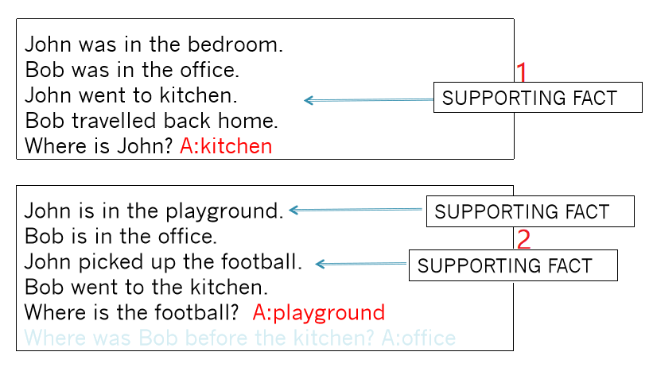
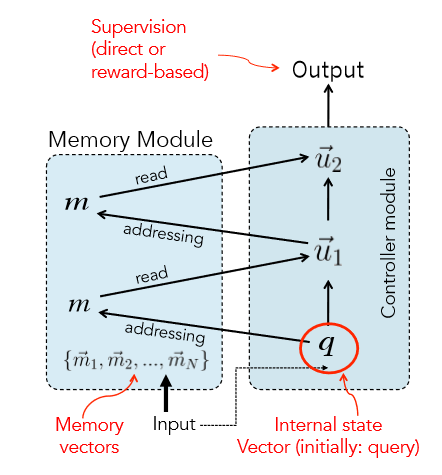
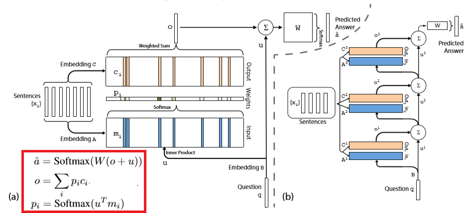
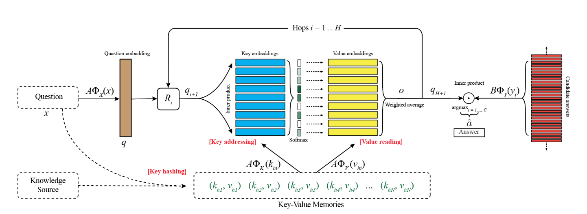
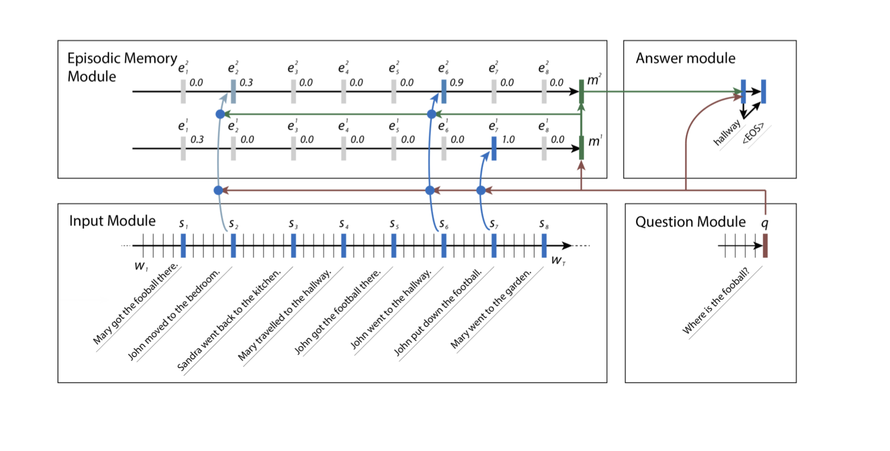

含有 memory 机制的神经网络模型称为 memory network，简称 MemNN。

顾名思义，在模型中引入可以读写的记忆，存储在记忆库中。对于一个问题，模型反复在记忆库中寻找有助于回答的相关信息。该模型的三要素是 reasoning + memory + attention，简称 RAM：通过对 memory 使用 attention，进行 reasoning，实现理性的理解或问答。从这点上看，这类模型其实与 attention-based reading model 有相通之处。

本文首先参考 ICML 2016 tutorial，标题为 Memory Networks for Language Understanding，面向语言理解的带有 memory 机制的神经网络。作者是 Jason Weston，内容主要是介绍 2014、2015 年 Facebook 在这方面的科研进展，包括相关的数据集和任务。

在此基础上，补充介绍其他几篇重点文章，或是因为发表于 2016 年以后，或是因为来自其他团队，而没有包含在原始 tutorial 中。

> ICML 2016 tutorial slides 见 http://www.thespermwhale.com/jaseweston/icml2016/

> 可以参考 NIPS 2015 workshop，主题为 Reasoning, Attention, Memory，见 http://www.thespermwhale.com/jaseweston/ram

# 相关任务与数据集

设想真正有用的对话系统，应该能够通过整合它拥有的知识来完成复杂的任务，有效记录许多隐变量来维持开放性的长对话，通过对话学习新任务。基于机器学习的端到端的对话系统具有很大的潜力，为此提出一组关键任务：

- 经典的语言建模，数据集包括 Penn TreeBank、Text8
- 故事的阅读理解，数据集 Children's Book Test、News articles
- 开放的问答，数据集 WebQuestions、WikiQA
- 面向目标的对话和闲聊，数据集 MovieDialog、Ubuntu

> 相关 QA 数据可在 http://fb.ai/babi 下载。

上面的数据集是从真实语料标注而来的。探索阶段，也使用一些生成或者爬取而非标注的数据集。

- Reverb 问答数据：Reverb 数据集是从 ClueWeb09 自动爬取的三元组，可以作为知识来源；从 WikiAnswers 构建的问答对和 paraphrase 问题，可以作为训练和测试语料。
> Fader et al. ACL 2013. Paraphrase-Driven Learning for Open Question Answering.

- bAbI 数据集：定义 20 个问答任务并模拟生成小数据集用于实验。包括推理、计数等任务，涉及搜索的任务相对困难，例如 Path Finding 。这个工作很像上古时代的文字交互游戏（interactive fiction game）。
> J. Weston, A. Bordes, S. Chopra, T. Mikolov. Towards AI-Complete Question Answering: A Set of Prerequisite Toy Tasks. arXiv:1502.05698.

<figure>
  
  <figcaption>bAbI 问答示例</figcaption>
</figure>

# MemNN: Memory Networks

> J. Weston, S. Chopra, A. Bordes. Memory Networks. ICLR 2015 (arXiv:1410.3916)

根据 MemNN 的开山之作，MemNN 基本模型设计包含四个模块，模块之间可以共享参数而不是相互独立：

- I，输入特征：将输入数据转换为内部的特征表示
- G，归纳：给定新输入，更新记忆库
- O，输出特征：根据记忆，产生待输出的特征表示
- R，应答：将内部的特征表示转换为对外应答

<figure>
  
  <figcaption>MemNN 基本模型</figcaption>
</figure>

除了如何读取记忆、如何设计 attention 以外，MemNN 还包括以下变式：

- 输入和记忆的编码：词袋，词或字符级别的 RNN，等等
- 输出模块：多分类器，RNN 解码为序列，等等
- 如果记忆库内容庞大：hash，按照话题划分桶
- 如果记忆库满了：引入遗忘机制

MemNN 模型：

- I：输入转换为基于词袋表示的向量 $x$
- G：$x$ 存储在记忆库下一个空位 $m_N$
- O：遍历所有记忆 $k$（1 或 2）轮，查找相关事实：
	- 第一轮：找到 $x$ 的最好匹配 $m_{o_1}$，即 $o_1 = \arg \max_{i} s_O(x, m_i)$
	- 第二轮：找到 $(x, m_{o_1})$ 的最佳匹配 $m_{o_2}$，即 $o_2 = \arg \max_{i} s_O([x, m_{o_1}], m_i)$
	- 输出 $o$ 由 $(x, m_{o_1}, m_{o_2})$ 表示
- R： 给定 $o$，返回词典中得分最高的单个词 $w_r$，即 $r = \arg \max_{j} s_R([x, m_{o_1}, m_{o_2}], w_j)$
	- 也可以使用 RNN 解码返回句子

O 和 R 模块都用到匹配打分函数 $s(x, y) = x^{\top}U^{\top}Uy$，$U$ 是需要训练的参数矩阵。

最小化目标函数：

$$\begin{split}
J = &\sum_{\bar{f} \neq m_{o_1}} \max(0, \gamma - s_O(x, m_{o_1}) + s_O(x, \bar{f})) + \\
&\sum_{\bar{f'} \neq m_{o_2}} \max(0, \gamma - s_O([x, m_{o_1}], m_{o_2}) + s_O([x, m_{o_1}], \bar{f'})) + \\
&\sum_{\bar{r} \neq r} \max(0, \gamma - s_R([x, m_{o_1}, m_{o_2}], r) + s_R([x, m_{o_1}, m_{o_2}], \bar{r}))
\end{split}$$

使用负采样策略， $\bar{f}, \bar{f'}, \bar{r}$ 是负例。$\gamma$ 是边际排序损失函数中的边际值，即正例得分应该比负例高出至少 $\gamma$。这种损失函数和训练策略在 Weston 等人的文章中非常常见。

这里，O 模块的每一回遍历，实际上是对记忆库的一步 hard attention。如果遍历不止一次，那么必须有中间步骤的监督信息，即真实的最佳匹配。通常的数据集只有结果，不会有推理过程，因此该模型要么在人为按规则生成的 bAbI 数据上实验，要么只能采用一次遍历，无法复杂推理。

在 Reverb 问答数据上，由于记忆库非常大，可采用向量的 k-means 或词的倒排索引进行 hash，前者能够在提速的同时不损失 F1，后者信息损失较大。

另外，在顺序事件的推理中，记忆的时间先后顺序非常重要。可以将 $x, y, y'$ 两两之间的先后顺序表示为三个 0/1 数值，将输出模块打分函数扩展到三元组 $s_O(x, y, y')$。如果 $s_O(x, y, y') < 0$，认为 $y$ 优于 $y'$。相应目标函数就更复杂，在此略去。

# MemN2N: End-to-end MemNN (Sukhbaatar 2015)

> S. Sukhbaatar, A. Szlam, J. Weston, R. Fergus. End-To-End Memory Networks. NIPS 2015 (arXiv:1503.08895)

原始的 MemNN 无法端到端训练，需要中间每一步推理的监督信息。MemN2N 对此做了重要的改进：

- 对记忆的 hard attention 改成 soft attention
- 能够多轮查找，端到端训练，不需要中间推理步骤的监督信息

<figure>
  
</figure>

单轮模型：

- I：输入的句子 $x_i$ 用两套词向量 $A$ 和 $C$ 编码为句向量 $m_i$ 和 $c_i$，问题 $q$ 用词向量 $B$ 编码为 $u$，编码方式为词袋中各词向量之和，可以用位置编码加权
- G：记忆 $m_i$ 依次存储在记忆库中
- O：计算记忆的权重（soft attention）：
	- 权重 $p_i = \textrm{softmax}(u^{\top}m_i)$，可以认为是用内积刻画问题与每个记忆的相似度
	- 输出 $o = \sum_i p_i c_i$
- R： 给定 $o$，用矩阵 $W$ 解码，返回 $a = \textrm{softmax}(W(o+u))$

多轮模型是将单轮模型通过 $u^{k+1} = u^{k} + o^{k}$ 堆叠起来，并引入权值共享技巧，例如像 RNN 模型一样共享所有层的词向量，即 $A^{1} = \dots = A^K$，$C^1 = \dots = C^K$。

端到端模型不再需要复杂的目标函数，只需要优化预测结果与真实结果的交叉熵或其他损失函数即可。此后的模型也都是如此。

# Self-supervised MemNN

> F. Hill, A. Bordes, S. Chopra, J. Weston. The Goldilocks Principle: Reading Children's Books with Explicit Memory Representations. arXiv:1511.02301. 

这篇文章的主要贡献是发布了 Children's Book Test 数据集，用于测试记忆和上下文在自然语言理解中的作用。给出一段儿童读物节选，接下来的一句话挖掉某个单词，模型需要从候选词中选出正确的单词。

此前的另一个自然语言理解数据集是 CNN/Daily Mail QA 数据集，给出一段新闻，接下来是一句总结，挖掉其中某个实体，模型需要填上正确的实体。两个数据集的逻辑区别在于前者偏重预测，后者则是复述。

>  Teaching Machines to Read and Comprehend, Hermann et al., NIPS 2015

至于模型，在 MemN2N 的基础上改进不大。首先是探索了记忆库的粒度，单词，完整的句子，以候选词为中心的窗口。实验表明窗口的效果更好一些。但是，观察到多轮 soft attention 模型只对词级别的记忆库有效，于是引入自监督机制：尽管训练数据提供的监督信息只是一个正确单词，无法直接进行 hard attention，不过我们大胆假设包含正确单词的记忆就是正确的 supporting memory，这就启发式地加强了监督信息，将模型改回了最初的单轮 hard attention。另一个小改进是 bypass module，就是将输出时的线性层也改为 hard selection。

不过，这篇文章的结果很快就被 RNN/CNN 加上各种 attention 的模型大幅超越了。

另一篇文章 Large-scale Simple Question Answering with Memory Networks 主要是探索了多任务学习、迁移学习。

接下来一篇 Evaluating Prerequisite Qualities for Learning End-to-End Dialog Systems 是提出了结合各种目标的 QA 和 对话数据集 MovieDialog，向端到端训练通用对话系统迈进了一步。

# KV-MemNN: Key-Value MemNN

> A. H. Miller, A. Fisch, J. Dodge, A. Karimi, A. Bordes, J. Weston. Key-Value Memory Networks for Directly Reading Documents. EMNLP 2016 (arXiv:1606.03126)

这篇文章在数据集和模型方面都有贡献。结合了知识库+文本的 QA，发布了数据集 WikiMovies，并提出一个问题：如果知识来源从结构化知识库换成无结构文本，QA 能否保持同样水平？确切说，知识来源有三种：

- (i) 从 Wikipedia 获得的纯文本
- (ii) 从 OMDB 和 MovieLens 创建的知识库，表示为实体-关系-实体三元组
- (iii) 用信息抽取工具从 Wikipedia 抽取的三元组关系

问答数据保证能由 (i) 或 (ii) 回答出来。

<figure>
  
</figure>

用来解决这一问题的模型叫做 KV-MemNN，因为它采用 key-value 形式的记忆库：用 key 寻址，索引相关的记忆，然后返回 value。为了高效寻址，key 的特征应该能够与问题相匹配，value 的特征应该有助于和答案相匹配。此外，模型要在引入 key-value 变换的同时，不破坏反向传播算法。

key 和 value 成对地保存在记忆库中，$(k_1, v_1), \dots, (k_M, v_M)$。给定一个问题，先缩小查找范围，然后反复更新查找，不断将找到的相关信息和问题整合在一起，使召回的记忆更相关：

- 哈希：首先用问题 $x$ 从整个记忆库中预选出一个小的子集 $(k_{h_1}, v_{h_1}), \dots, (k_{h_N}, v_{h_N})$，这里 $N \ll M$；用倒排索引实现，找到与问题有共同词的 key（去掉高频停用词）

- 初始 $q_0 = A \Phi_X(x)$，在第 $j$ 轮（$j \leq H$）：
    - 寻址：将问题 $q_j$ 与候选记忆子集中的每个 key 比较，计算相关概率 $p_{h_i} = \mathrm{softmax}(q_j^{\top} A \Phi_K(k_{h_i}))$
    - 读值：对上述候选记忆的 value 按照相关概率加权求和，返回 $o = \sum_i p_{h_i} A \Phi_V(v_{h_i})$
    - 更新：$q_{j+1} = R_j(q_j + o)$

- 输出答案 $\hat{a} = \arg \max_i (\mathrm{softmax}(q_H^{\top} B \Phi_Y(y_i)))$

端到端训练，学习 $A, B, R_i$ 的参数。如果去掉哈希步骤，令 key 与 value 相同，则本模型就退化为 MemN2N。

$\Phi_X$、$\Phi_K$、$\Phi_V$、$\Phi_Y$ 是将相应文本映射到 $D$ 维特征向量的编码器。文章讨论了记忆 key-value 的几种编码方式。

总的来说，这个模型引入了一种更具备结构化、符号化特性的记忆格式，利用较大规模的记忆库完成了较为复杂的任务。

# EntNet: Recurrent Entity Networks

> M. Henaff, J. Weston, A. Szlam, A. Bordes, Y. LeCun. Tracking the World State with Recurrent Entity Networks. ICLR 2017 (arXiv:1612.03969)

在此前一系列 MemNN 模型中，记忆库从初始化存储之后就不再改变，每一轮整合当前信息，更新 query。实际上完全可以解读为利用 attention 的文本检索，可见 memory 的概念界限仍然不是十分明确。

另一种思路是，query 本身不变，更新记忆库的状态，每一条记忆变成一条可变的记录。这就是 EntNet 的出发点：在 KV-MemNN 的基础上，动态更新记忆的 value。

以 bAbI 数据为例，在 MemN2N 模型中，小故事中的每个句子会按顺序读入记忆库，记忆库就是这些句子的表示；而在 EntNet 中，记忆库的 key 是每个实体（人、物、地点等等），每次按顺序读入一个句子，都会更新句子中提到的实体所对应的记忆 value。

更新算法借鉴了 RNN 的结构，引入门限。但是比 GRU 更简化，只有一个门，信息流与 2016 年的 Minimal Gated Unit for Recurrent Neural Networks 这篇文章类似，不过其实 EntNet 发表更早。

记忆库中保存着固定长度的 key-value 对，$(k^1, h^1), \dots, (k^M, h^M)$。

在时刻 $t$，输入 $x_t$，对每一个 $(k, h)$（为方便，省略上标），计算它们与输入内容的相似度，作为门限。由于记忆块彼此之间是独立的，可以并行更新：

- $g_t = \sigma (x_t^{\top}h_{t-1} + x_t^{\top} k)$
- $\tilde{h}_t = \phi (U h_{t-1} + V w + W x_t)$
- $h_t = h_{t-1} + g_t \circ \tilde{h}_t$

然后归一化 $h_t$ 长度为 1，即 $h_t \leftarrow \frac{h_t}{\lVert h_t \rVert}$。

输出模块沿用 MemNN 的 attention 结构，计算 $p_j = \mathrm{softmax} (q^{\top} h_j)$ 和 $u = \sum_j p_j h_j$，输出 $y = R \phi(q+Hu)$。

该模型与 attention 模型的差异较为明显。它能够跟踪更新若干 key-value 对，例如记录若干实体的状态、位置，所以应用潜力不局限于阅读理解，也向真实世界的建模前进了一步。

# Dynamic MemNN

> A. Kumar, O. Irsoy, P. Ondruska, M. Iyyer, J. Bradbury, I. Gulrajani, V. Zhong, R. Paulus, R. Socher. Ask Me Anything: Dynamic Memory Networks for Natural Language Processing. ICML 2016 (arXiv:1506.07285)

Dynamic Memory Network （DMN）也是一种动态记忆模型，作者不是 Facebook 的 Weston 等人，而是 Socher 等人，斯坦福 cs224 课对该模型有过介绍。

DMN 的大致结构与多轮查找的 MemN2N 相似，但是有两个主要的不同点：一是将所有编码器都从向量加权求和改成 GRU，最后的解码器也从矩阵映射改成 GRU，即词袋模型改为序列建模；二是引入 episodic memory（情境记忆），每一轮更新一个情境向量，再用这个情境向量去更新记忆向量。

所谓情境记忆，是与特定时间、地点、事件相关联的个人记忆。有心理学研究认为，每次回想情境记忆的时候，记忆本身会更新，加入有关当前状态的信息。

<figure>
  
</figure>

DMN 每一轮对记忆向量的更新方式是 GRU + attention：

- $h_t^i = g_t^i GRU(c_t, h_{t-1}^i) + (1-g_t^i) h_{t-1}^i$
- $e^i = h_T^i$
= $m^i = GRU(e^i, m^{i-1})$

其中 attention 也改成了对每个 $t$ 分别计算门限 $g_t^i = G(c_t, m^{i-1}, q)$，$G$ 是一个可以反向传播训练的函数。
初始化 $m^{0} = q$。

显然，DMN 是一个典型的 NLP 模型，并且它在更新记忆时必须逐步计算，无法像 EntNet 那样并行计算。

# 问题与展望

以下是 tutorial 最后提出的问题。

- 如何确定记忆的更新与遗忘？
- 如何对记忆库的知识进行表示和压缩？
- 如何评价和选择不同的记忆库类型，如外部数组、栈、模型内部权重？
- 如何从大规模记忆库快速检索知识？
- 如何构建层次记忆、层次推理，如多尺度 attention？
- 如何评估推理模型？人为设计的伪任务和真实任务的差距？
- 动物与人类的记忆机制能提供什么启发？

我的感受是，attention 模型的强大有目共睹，有不少模型打着 memory 的幌子实际上还是做 attention；EntNet 是另一个方向，遥遥指向符号主义与联结主义的大一统。
