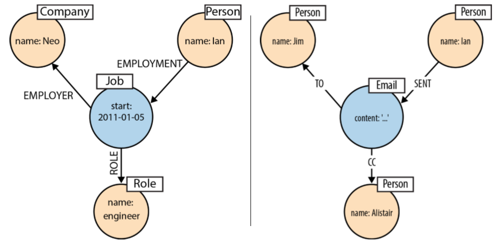
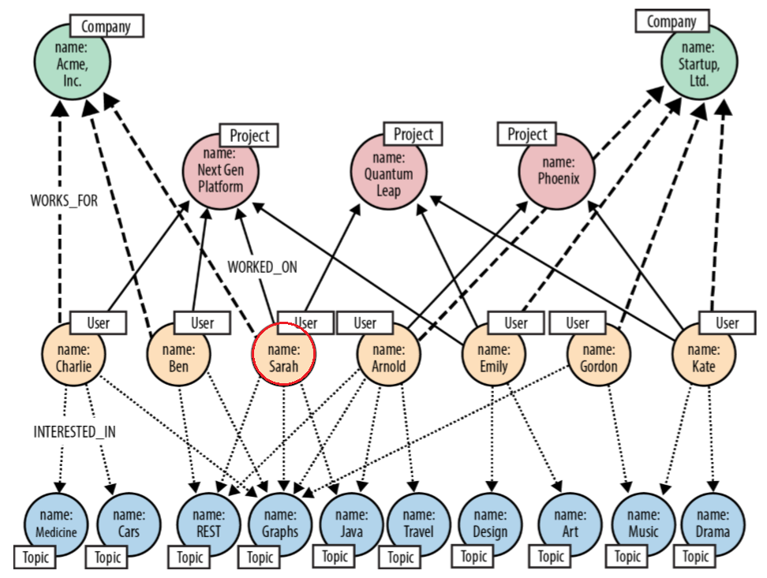
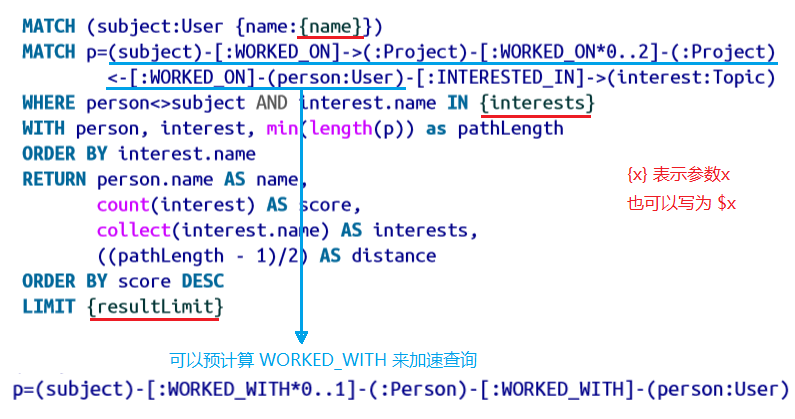
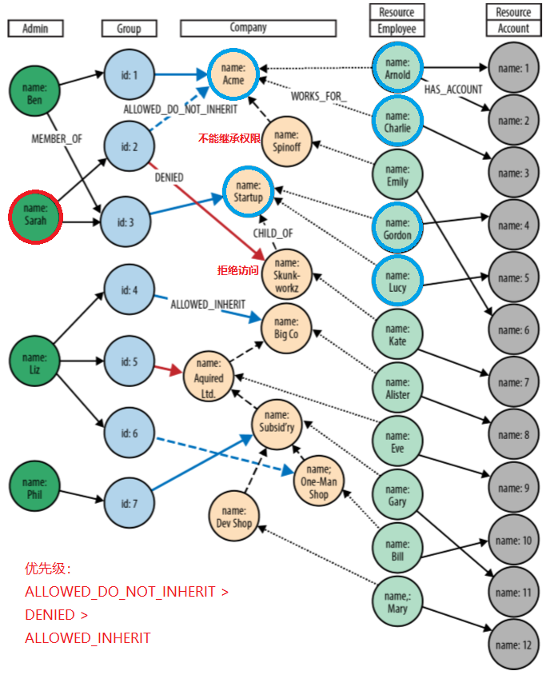

本文是《图数据库》（Graph Databases）一书的读书笔记。该书作者为 Neo 公司 Neo4j 项目专家。全书不到两百页，以 Neo4j 图数据库和 Cypher 查询语言为示例，介绍图数据库的原理、思想和应用。至于技术开发细节，不是该书的重点，建议阅读 Neo4j 官方文档。

这本书的主要价值是如何从零开始设计、构建和查询图数据库，因此它命名为图数据库而不是 Neo4j 技术指南是十分合理的。特别是其中第 5 章的现实世界中的三个示例，平时很少看到哪家公司公开讲解其数据模型和逻辑，这一部分值得仔细研读。

以下是阅读时记录的一些要点。

# 为什么使用图数据库？

扁平的关系型数据库的局限性：

- 图遍历和模式匹配查询性能不好，往往需要多次 `JOIN`。
- 查询代价不对称，例如查找谁是某人的朋友很容易用索引完成，但是查找谁的朋友是某人就需要扫描整张表，除非引入反向指针，使数据库反规范化（denormalization）。
- 为了加速查询，不同表上经常 JOIN 查询的数据会被人为合并到一张表上，导致数据重复冗余，这也是反规范化。
- 对递归多级关系的查询代价异常高，例如查找某人的五度朋友。
- 数据库重构、迁移风险很高。

图数据库适合处理结构可变、关联密集的复杂数据：

- 图遍历效率高，可以维持毫秒级的性能。
- 开发周期显著缩短，架构无需在对象模型和关系表之间来回转换。
- 极速的业务响应能力。
- 企业可用。

带标签的属性图包括：

- 节点，它包含属性。
- 标签，每个节点可以有一个或多个标签，标识它们在数据集中的角色。
- 关系，它有方向和名称，连接两个节点，它也可以有属性。
- 属性，表示为键值对，除了表示实体、关系的性质以外，也可用于记录时间戳、版本号等元数据。

除了属性图以外，图数据库也可以采用三元组的结构，但它不是原生图数据库。此外，超图是一种更广义的图，每条边可以关联任意数量的节点，适合多对多关系为主的场景。

# 如何用图进行数据建模？

通过电子邮件收发建模案例，总结面向查询的设计过程：

- 描述建模目的客户的目标，改写成领域问题的形式。
- 识别出问题中的实体和关系，翻译为路径表达式，表示为图模式。
- 以电子邮件为例，问题中的普通名词构成标签，专有名词构成节点（实例)，及物动词构成关系。

图数据库应用适合采用演化的、增量的、迭代的、测试驱动的软件开发方法。测试包括单元测试和性能测试。

图模型的设计要点：

- 双向关系不应该重复建立两个单向关系，而应该让查询忽略方向。
- 不要将实体建模为关系，特别是它连接超过两个实体的情况下。关系只能表示实体-实体的联系，难以表示关系-关系的联系。例如不应该用“发送邮件”、“转发邮件”、“抄送邮件”连接不同人，以免丢失它们之间的关联，应该用“发送”“转发”“抄送”“收到”连接人与邮件实体。
- 如果细粒度的关系属于一个有限的集合，可以建模为细粒度关系名，例如 `DELIVERY_ADDRESS` 和 `HOME_ADDRESS`；否则，可以建模为属性，例如 `ADDRESS {type:'delivery'}` 和 `ADDRESS {type:'home'}`；关系的权重通常会建模为属性。
- 如果两个或多个实体交互持续一段时间，构成一则事实，可以建模为独立节点。例如某人在某公司担任某职位，工作经历可以作为独立节点；某人将邮件发送、抄送给他人，邮件是独立节点。
- 时间可以建模为时间轴树或者（双向）链表。

<figure>
  
  <figcaption>事实建模为独立节点</figcaption>
</figure>

# 三个现实应用示例

## 职业社交网络

两个用例：

- 给定用户，根据兴趣、技能相似度，推测社交关系；
- 给定用户，推荐具有特定技能的人，推荐范围为曾经与该用户共事相同项目的同事，或同事的同事。

启示：如果非常频繁地遍历显式关系来推断隐式关系，例如寻找同事或同事的同事，那么可以通过预计算，将这种隐式关系转换为显式关系，改进查询性能。

<figure>
  
  <figcaption>职业社交网络的图模型</figcaption>
</figure>

<figure>
  
  <figcaption>职业社交网络的查询</figcaption>
</figure>

## 授权和访问控制

三个用例：

- 列出管理员可访问的所有资源；
- 判断管理员能否访问某一资源；
- 找到一个账号的管理员。

<figure>
  
  <figcaption>授权和访问控制的图模型</figcaption>
</figure>

思考：管理员分组，每组对公司具有不同的权限关系：`ALLOWED_DO_NOT_INHERIT`、`DENIED`、`ALLOWED_INHERIT`，优先级递减。通过它们之间的逻辑，分组分层控制权限。
为什么不采用预计算，推断出直接可查询的 `ALLOWED` 关系呢？

## 地理空间和物流

一个用例：

- 查找最短派送路由，即计算加权最短路径。

启发：对于复杂的查询、计算和过滤，以及需要支持并发的场景，开发可以不局限于 Cypher 语句，而使用 Neo4j 的遍历框架（Traversal Framework）。

查询图的三种方法：

- Cypher，抽象层次高，开发者很难控制其效率。
- 遍历框架，声明型 Java API，抽象层次介于 Cypher 和核心 API 之间。
- 核心 API，命令型 Java API，将图的基本元素暴露给用户，允许精心优化，因此写起来更繁琐，但是运行更快；代码内容和图结构紧密耦合，因此容易被破坏。

# Neo4j 图数据库的内部结构

Neo4j 是具有原生图处理和原生图存储能力的图数据库。

原生图处理：免索引邻接（index-free adjacency），降低遍历代价，特别是反向遍历。

索引遍历查询某人的朋友是谁，以及某人是谁的朋友，分别需要 O(log n) 和 O(m log n)，而免索引邻接遍历只需要 O(k)，其中 n 是节点个数，k 是某人朋友个数。关系通常是稀疏的，因此免索引邻接遍历更高效。

原生图存储：图结构与属性数据分离，节点、关系保存为固定长度的记录，因此可以 O(1) 时间内快速寻址。

- 节点存储，每条记录包括：标志位，指向第一个关系的指针（ID），指向第一个属性的指针（ID），指向标签的指针，等等。
- 关系存储，每条记录包括：指向首、尾节点的指针（ID），指向关系类型（属性）的指针，分别指向首、尾节点的前后一条关系的指针（即两个双链表），等等。
- 属性存储，每条记录包括：四个属性块，指向下一个属性的指针（单链表）。

Neo4j 使用 LRU-K 页面缓存算法提升访问性能。

