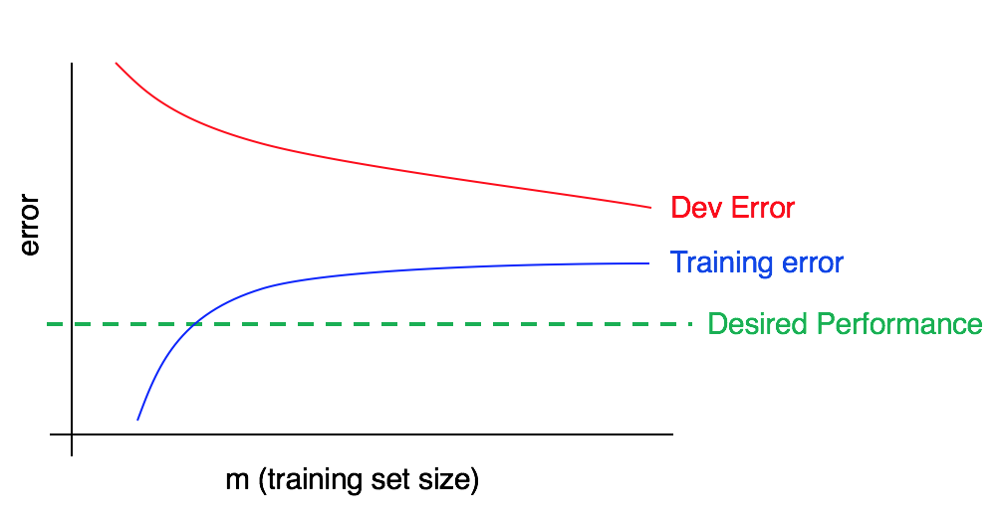

本文是 Machine Learning Yearning 的阅读笔记，但是与原书的结构、顺序和内容不完全一致。

原书请在 mlyearning.org 获取，作者是 Andrew Ng。

## 构建机器学习系统的迭代方法

1. 想法 idea
2. 代码 code 
3. 实验 experiment，在开发集上用指标评估性能，回到第 1 步

最佳实践：

- 尽快确定指标 metrics
- 尽快建立开发集、测试集
- 尽快搭建并训练简单的系统，绘制学习曲线
- 建立训练集、训练开发集
- 通过开发集的误差分析来寻找改进方向

## 开发集/测试集/指标

### 指标

单个指标可以明确性能目标方向。尺度相似的多个指标可以合为一个指标，例如 precision 和 recall 整合为 F1。

有些指标可以设定为阈值形式，不要求进一步优化，例如运行时间限制。

### 开发集和测试集

开发集用于迭代评估算法和做改进决策。
开发集的大小应当保证检测出不同算法的性能差异。

测试集用于开发完成后评估系统，不能用于对算法做决策。
测试集的大小应当保证充分可靠地估计算法的性能。

开发集和测试集应当尽可能代表预期需要处理的实际数据，不一定与训练集的分布保持一致。

开发集和测试集应当具有一致的分布。如果在开发集上过拟合就可以通过增加开发集数据解决。

如果开发集和测试集分布不一致，则无法确定算法在开发集和测试集上的性能差异是来源于过拟合还是分布差异，因此很难确定改进工作的方向和效果。

## 误差

### 误差分析

对于人类能够很好完成的任务，例如图像分类，可以通过人工检查算法出错的开发集样本，分析原因，确定改进思路和优先级。

如果检查一部分而不是全部出错样本，则开发集分为 

- 人工检视过的 Eyeball 开发集，这一部分会更快的过拟合
- 没有检视的 Blackbox 开发集，这一部分用于决策算法和调整超参

训练集也可以进行类似的误差分析。

### 学习曲线

横轴为训练集大小，纵轴为误差，可以绘制训练误差曲线和开发误差曲线。

<figure>
  
  <figcaption>学习曲线</figcaption>
</figure>

假如小样本训练集噪声大，影响绘制学习曲线，解决方案是

- 重复多次抽样，计算平均误差
- 分层抽样，使样本分布与训练集全体更接近

### 人的性能

对于人类擅长的识别任务，人的性能是一个很重要的基准，此时

- 容易用人工标注获取数据
- 容易人工进行误差分析
- 可以用人的错误率作为不可避免偏差的估计

反之，对于商品推荐、广告投放、股票预测等任务，人类并不擅长，此时

- 难以通过人工标注获取数据
- 难以依靠人工进行误差分析
- 难以估计期望错误率和改进空间

### 偏差和方差

不严谨地借用偏差和方差的术语：

- 偏差：算法在训练集上的误差
- 方差：算法在开发集（测试集）上的表现低于训练集的程度

我们希望偏差尽可能低，但是有可能存在不可避免偏差，因为人类标注有时也会出错或无法识别。

|方法|偏差会增加还是减少|方差会增加还是减少|备注|
|--|--|--|--|
|增大模型规模|减少|增加|使用正则化，避免方差增加|
|减少模型规模|增加|减少|不建议使用|
|误差分析，增加特征|减少|可能增加|使用正则化，避免方差增加|
|特征选择，减少特征|可能减少|可能增加|适用于训练集小的情况|
|加入正则化，包括 early stopping|增加|减少||
|减少正则化|减少|增加|不建议使用|
|增加训练数据|通常无影响|减少|设法增加与开发集匹配的训练数据|
|修改模型架构|不一定|不一定||

## 训练与改进

### 训练集

尽可能获取目标任务的真实数据，一部分作为开发集和测试集，一部分作为训练集。

如果一些外部数据对目标任务有帮助，只是分布不尽相同，在模型较大的情况下，可以将它加入训练集。如果担心它影响模型，可以在 loss 中对该样本来源降低权重。

人工合成数据可以用来扩充训练数据，但是需要注意避免对样本来源的过拟合。

### 训练开发集

算法开发集/测试集误差高，可能有以下几种情况

- 高偏差：训练集上表现不佳
- 高方差：训练集表现好，但训练集分布相同的未知数据泛化不好
- 数据不匹配：训练集分布相同的未知数据泛化好，但开发集/测试集分布相同的数据泛化不好

为了判断到底是哪种情况，可以增加一个训练开发集：与训练集分布相同，不参与训练。

### 推断算法 debug

以语音识别为例，误差可能来源于最后的 inference 环节，包括

- 搜索算法不正确
- 目标得分函数不正确

在误差分析中，可以执行优化验证测试，将样本的错误输出与更优输出对比，分析误差来源，从而确定改进方向。

这种方法在强化学习中很有效。

### 流水线

流水线系统将学习分为几个组件顺次完成，包含很多人工设计的成分。尽量构建简单、可学习、有相应训练数据的组件。

端到端系统使用一个算法直接从输入到输出，需要有相应的训练数据，可以直接学习复杂的输出，例如机器翻译或给图像配文字。

对流水线组件进行误差分析和归因，对于开发集的每个错误样本，按流水线顺序尝试人为修改各组件的输出为正确输出，直到流水线的输出结果变为正确，那么误差归因为当前组件。

如果流水线每个组件的性能接近人类水平，但是总体性能远低于人类水平，那么流水线本身存在缺陷，可能需要补充输入信息和组件。

