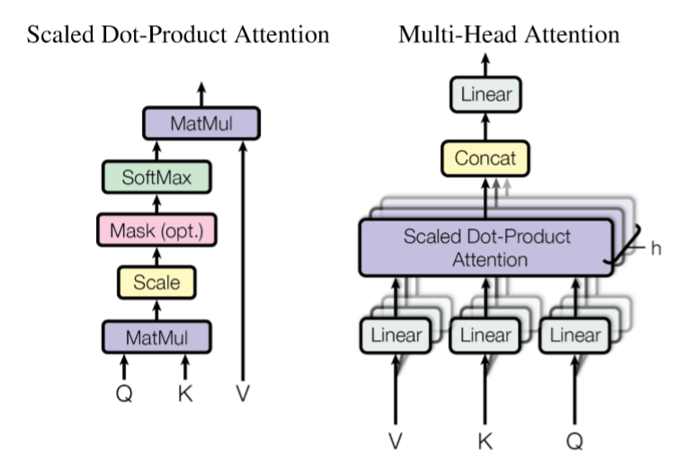
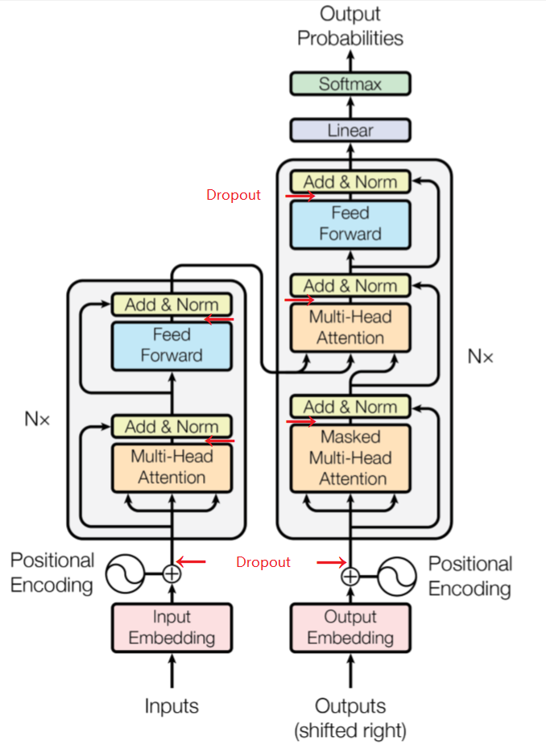
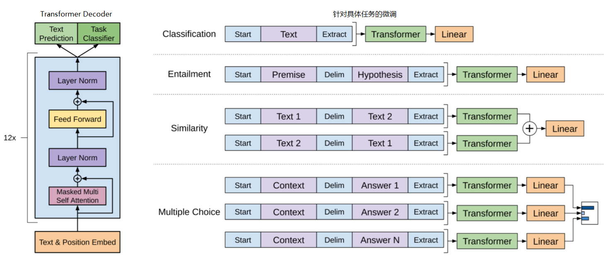
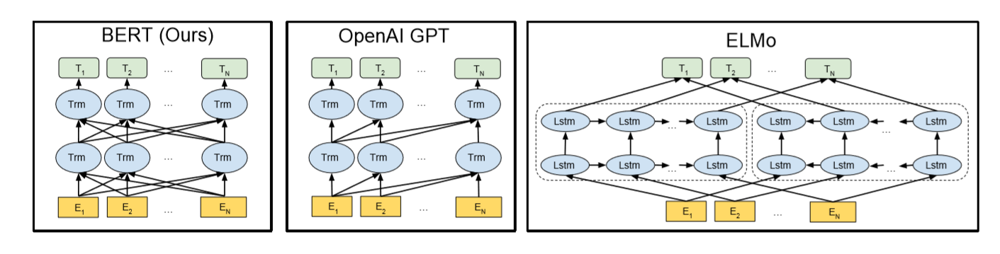
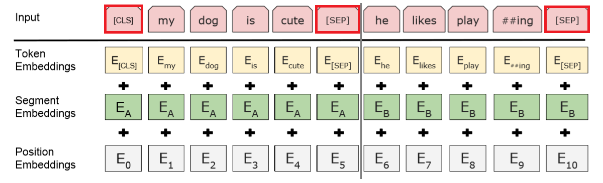

最近双向的预训练语言模型 BERT 引起关注。它是单向预训练模型 OpenAI GPT 的改进，两者都基于 Transformer 模型。本文介绍这三篇文章。

首先解释一下什么是单向，什么是双向。所谓双向，我们都很熟悉 bidirectional RNN，是两个模型方向相反（或者说是原始序列分别正序和逆序输入），因此一个模型从前到后，一个模型从后到前，总的模型可以利用两个方向的信息；而单向 RNN 只有一个方向，只能利用上文的信息，或者说是某个时间点之前的历史信息。实质上，bi-RNN 模型有两个方向相反的模块，这只是显式的、结构上的双向模型；使用两侧的信息，才是真正的双向模型，但它并不一定要包括两个方向相反的模块。

例如对序列做一维卷积，如果使用一个时序受限的 mask，使每个位置只能获得此前位置的信息，这就是单向模型；去掉这个 mask 的限制，模型就变成了双向模型。再比如词向量，如果只用前四个词去预测第五个词，这就是单向模型；如果用上下文四个窗口词去预测中间这个词，这其实就是双向模型。

## Transformer

> Ashish Vaswani et al. Attention is All You Need. arXiv 1706.03762.

Transformer 的最主要动机就是用 self-attention 用于文本建模，取代不能并行的 RNN。

之前介绍过的 end-to-end memory network 运用了类似的 recurrent attention 取代 RNN，也有不少人用卷积来取代 RNN，不过 self-attention 在训练速度和性能上有着明显的优势。

### Multi-head Attention

所谓 attention 可以理解为给定 query 和 key-value pairs，将 query 和每个 key 计算一个匹配度作为权重（通常做点积），对 value 加权求和，作为输出。

除了在 key-value memory network 中，key 和 value 不相同，一般的 NLP 模型中 key-value 都是相同的。

本文的 attention 是 Scaled Dot-Product Attention：
$$\text{Attention}(Q, K, V) = \text{softmax} \left( \frac{QK^{\top}}{\sqrt{d_k}}\right) V$$

- key 和 query 的维数是 $d_k$，value 的维数是 $d_v$ （本文中维数都是 64）
- 计算 query 和 key 的内积，并除以 $\sqrt{d_k}$ （为避免 softmax 饱和），再经过 softmax，得到权重，对 value 加权求和

单个 attention 所能注意到的信息是有限的，通过 multi-head attention 克服这一点：
$$\text{MultiHead}(Q, K, V) = \text{Concat}(\text{head}_ 1, \ldots, \text{head}_ h) W^O$$
$$\quad \text{head}_ i = \text{Attention}(QW_i^Q, KW_i^K, VW_i^V)$$

- 学习若干组不同的线性映射 $W$（权值不共享），将 query、key、value 分别投影到 $d_k$、$d_k$、$d_v$ 维的空间里（等价于一维卷积），每一组称为一个 head
- 对投影后的结果，并行计算 attention，得到 $d_v$ 维的值
- 拼接并经过线性映射 $W^O$，得到最终的 multi-head attention
- 实验表明，head 数量太多或太少都会损失信息，本文选择 8

<figure>
  
  <figcaption>Attention 机制</figcaption>
</figure>

### Transformer

常规的 encoder-decoder 结构：encoder 将一个输入序列由符号表示 $\boldsymbol{x} = (x_1, \ldots, x_n)$ 映射到连续表示 $\boldsymbol{z} = (z_1, \ldots, z_n)$。decoder（依次）生成输出序列 $\boldsymbol{y} = (y_1,\ldots, y_m)$，生成 $y_k$ 时要用到 $y_{k-1}$ 作为输入。

Transformer 模型延续这一结构：encoder 和 decoder 分别包括 6 层，每层输出都是 512 维。

encoder：每层包括两个 sublayers，连接方式为 Norm(x + sublayer(x))

- multi-head self-attention
- position-wise 全连接前馈网络

decoder：每层包括三个 sublayers，连接方式同上

- multi-head self-attention，通过 mask 保证只依赖于当前位置之前的输出
- multi-head attention，输入是 encoder 的输出
- position-wise 全连接前馈网络

<figure>
  
  <figcaption>Transformer 模型结构</figcaption>
</figure>

可见，Transformer 中的 multi-head attention 有三种形式，分别是

- encoder-decoder attention: query 来自 decoder 的前一层，key-value 来自 encoder 的输出，因此解码输出的每个时刻都可以注意到完整的输入序列，与 seq2seq + attention 类似
- encoder self-attention: query 和 key-value 都来自 encoder 的前一层
- decoder self-attention (masked): query 和 key-value 都来自 decoder 的前一层的当前位置左侧，通过 mask 右侧的信息避免 auto-regression

Transformer 中还有一种层是 position-wise 全连接前馈网络，即两次线性变换，中间经过一次 ReLU
$$\text{FFN}(x) = \max (0, xW_1 + b_1)W_2 + b_2$$
等价于两次卷积，卷积核尺寸为 1。严格说来，这个模型并不像标题说的那样只有 attention，不知道这个卷积对整个模型的贡献有多少……

输入和输出的 embedding，以及最后的 softmax 之前的线性变换，共享权值。

到目前为止，整个模型并没有捕捉到顺序信息（除了全连接层），必须引入顺序信息。这种做法在传统的近乎词袋的模型中非常常见，例如 end-to-end memory network。这里选择的是正弦构造的位置编码
$$\text{PE}(p, 2i) = \sin(\frac{p}{10000^{2i/d}})$$
$$\text{PE}(p, 2i+1) = \cos(\frac{p}{10000^{2i/d}})$$
$p$ 是位置，$i$ 是相应的维度，$d$ 是 512 维。

选择正弦的原因是：它能一定程度上表达相对位置，因为 $\sin(p+k)$ 可以表成 $\sin(p)$ 和 $\cos(p)$ 的线性组合；通过插值，即使测试集上的序列长度超过训练集的最长序列，它也可以给出位置编码。

> 关于 positional encoding，详见  Jonas Gehring et al. Convolutional sequence to sequence learning. arXiv:1705.03122. 

### 分析

在类似场景下，常用的网络结构是 RNN 和 CNN。考虑每一层的计算复杂度，并行的计算量（表示为最少的必须顺序进行的运算数，即并行情况下至少需要先后执行几步），以及长程依赖关系的路径长度（表示为最远的一对输入、输出位置之间的路径长度，即需要几层才能使输入、输出全连接）。我们希望计算复杂度小，无法并行的顺序运算少，长程依赖关系的路径短，从而更容易学习长程依赖关系，更快速训练模型。

长程依赖关系是语言模型的根本挑战。要想捕捉到整个序列任意两个位置的关系，RNN 需要双向完整递归一遍才有可能做到，CNN 需要堆叠若干层才能让感受野逐渐扩大到整个序列（dilated 卷积比连续卷积感受野更大），利用最简单的全连接层可以一次性获得全局信息但是区分度有限，而 attention 同样可以一次性获得全局信息并且注意到匹配与差异，这就带来了明显的理论优势。

在序列特别长，不需要特别长程的依赖关系的情况下，可以将 attention 窗口从整个序列限制到局部，以当前位置为中心、大小为 $r$ 的窗口范围。由于文章没有提供这部分的实验数据，不知道这和同样大小的核的卷积相比是否存在性能差异。

| 类型 | 每层的计算复杂度 | 顺序运算数 | 最大路径长度 | 备注 |
|-|-|-|-|-|
| Self-Attention| $O(n^2 d)$ | $O(1)$| $O(1)$||
| Recurrent| $O(n d^2)$ | $O(n)$| $O(n)$|通常情况下 $n<d$|
| Convolutional| $O(k n d^2)$ | $O(1)$| dilated: $O(\log_k(n))$; contiguous: $O(n/k$)|$k$ 是核的大小，$k<n$|
| Self-Attention (restricted)| $O(r n d)$ | $O(1)$| $O(n/r)$|$r$ 是窗口长度|

### 训练

WMT 2014 英-德句对，byte-pair 表示；WMT 2014 英-法句对，word-piece 表示。每个 batch内的句子序列长度相近。

> 关于 byte-pair，详见 Denny Britz et al. Massive exploration of neural machine translation architectures. CoRR, abs/1703.03906. 

> 关于 word-piece，详见  Yonghui Wu et al. Google's neural machine translation system: Bridging the gap between human and machine translation. arXiv:1609.08144.

每一层 add&norm 之前有 dropout。

通过 label smoothing，提升正确率和 BLEU 分值。

> 关于 label smoothing，详见  Christian Szegedy et al. Rethinking the inception architecture for computer vision. CoRR, abs/1512.00567.

## OpenAI GPT

> Alec Radford et al. Improving Language Understanding by Generative Pre-training. 2018. 

无监督预训练语言模型，有监督微调，提升自然语言理解任务上的表现。

<figure>
  
  <figcaption>OpenAI GPT 模型架构</figcaption>
</figure>

### 无监督预训练

这里使用传统的马尔可夫语言模型，目标函数为给定上文若干个词预测下一个词
$$L_1(\mathcal{U}) = \sum_i \log P(u_i | u_{i-k}, \ldots, u_{i-1}; \Theta)$$

模型结构为 Transformer decoder，使用 multi-head self-attention 
$$h_0 = UW_e + W_p, \quad U = (u_{-k}, \dots, u_{-1})$$
$$h_l = \text{transformer_block} (h_{l-1}), \quad l = 1, \ldots, n$$
$$P(u) = \text{softmax}(h_nW_e^{\top})$$

有必要指出，尽管 Transformer 模型本身完全可以是双向的，例如之前的 encoder；但是，这里因为马尔可夫语言模型的目标函数是单向的，所以采用了单向的 Transformer decoder。所谓单向指的是，每个词都只关注左侧的上文而忽视右侧的下文。这表明，问题其实出在语言模型的目标函数上，因此为 BERT 引入填空任务埋下了伏笔。

### 有监督微调

取 最后一个 transformer block 的激活层输出 $h_n^m$ ，增加线性预测层
$$P(y|x^1, \ldots, x^m) = \text{softmax}(h_n^m W_y)$$
$$L_2(\mathcal{C}) = \sum_{(x,y)} \log P(y|x^1, \ldots, x^m)$$

这一步可以将 $L_1$ 整合到训练目标中，提高有监督模型的泛化能力，加快训练收敛
$$L_3(\mathcal{C}) = L_2(\mathcal{C}) + \lambda L_1(\mathcal{C})$$

预训练语言模型时，使用的输入是连续文本序列，而有些任务的输入是句对或者段落问答三元组。
我们希望让模型直接迁移到这些任务上，减少微调时引入的新参数，因此设法将它们的输入也表示为连续的文本序列：

- 随机初始化首末标识符，分隔符
- 对于不同任务，使用分隔符将输入拼接成连续的文本序列

## BERT: Bidirectional Encoder Representation from Transformers

> Jacob Devlin et al. BERT: Pre-training of Deep Bidirectional Transformers for Language Understanding. arXiv 1810.04805.

### 无监督预训练

预训练计算量非常大。

#### 目标函数

在 OpenAI GPT 模型的基础上，进一步提升预训练模型的表达能力和泛化能力，主要改进是目标函数。

之前已经注意到，Transformer 模型具有双向捕捉序列信息的能力，但马尔可夫多元组的目标函数使模型仍然局限在单向预测上。为了从无监督语料中获得双向的目标函数，引入填空任务：随机 mask 一部分词，从上下文预测原词。

这个任务的思路与 word2vec CBOW 相似，但是它不是一个词袋模型，而是一个能够捕捉顺序信息的深层序列模型，因此它比 word2vec 更慢、更复杂、但效果更好地实现了“基于上下文的分布式表示”。很多人看到 bidirectional Transformer，以为它像 bidirectional RNN 一样是显式的双向，这是不对的。它只是用了一个双向的目标函数，使模型中引入了两侧的信息。

<figure>
  
  <figcaption>BERT 模型与其他模型的对比，可见 BERT 是深层双向模型</figcaption>
</figure>

如果只是随机将 15% 单词替换为 [MASK] 并预测原词，该模型无法迁移到不包含 [MASK] 符的其他任务上。我们希望模型对每一个词都训练出基于上下文的表示，因此理想情况下，每个词都按照一定的分布出现在填空位置

- 随机选择 15% 的 token
- 80% 情况下，将它替换为 [MASK]
- 10% 情况下，将它替换为随机单词（不考虑单词分布，直接随机 index）
- 10% 情况下，保留原词

换句话说，12% 的词被替换为 [MASK]，1.5% 的词被替换为随机单词，其他词保持不变。这些比例似乎是根据直觉选择的，不知道这样引入噪声对避免退化或加速收敛的帮助有多大。

自然语言理解的下游任务往往需要句子之间的关系，为此引入另一个预测下句任务：给定上句，判断下句。选取若干句对，50%情况下是正样本，50%是随机负采样。这与 skip-thought 句向量（arXiv 1506.06726）也很相似。

训练代价函数是以上两个任务 mean likelihood 的简单求和。

在 128k words/batch 训练 1M 步比训练 0.5M 步仍然有明显的提升，表明预训练的收敛是困难的，需要完成庞大的计算量。

#### 文本表示

对于分类任务，每个句子的第一个 token 是特殊的分类符 [CLS]，最终该位置的输出将作为句子表示，用于分类。

每一个词表示为 word-piece 词向量 + 位置向量 + 句向量之和。位置向量不是 Transformer 论文里那样计算的，而是训练得到的。A/B 句向量也是训练得到的，如果只有一个句子那么它使用 A 句向量。

<figure>
  
  <figcaption>BERT 文本表示</figcaption>
</figure>

对比，OpenAI GPT 是在微调阶段才引入这些特殊标识符，而 BERT 在预训练阶段就训练了这些标识符，减少微调部分的训练负担。

### 有监督微调

如果下游任务是句子级别的分类，只需要获得固定维数的句子表示：获取 Transformer 最后一层输出的第一个向量（对应于 [CLS]），记为 $C$，增加线性分类层 $P = \text{softmax}(CW^{\top})$。

如果是序列标注，例如命名实体识别，直接用 $T_i$ 输入分类器，预测标签。这相当于在 Transformer 最后一层输出之后接一个 TimeDistributed 线性变换分类层。主流的序列标注模型最后一步解码会利用上下文预测信息，例如 CRF。而 BERT 模型没有用到这一信息也获得了更好的性能。 

如果是阅读理解问答，需要根据问题预测输入段落中的一个区间。将问题和段落整合为一个句子，分别使用 A/B 句向量。
学习两个向量 $S$ 和 $E$，用于注意答案的起点和终点。
Transformer 最后一层输出的向量记为 $T$，第 $i$ 个词对应的向量是 $T_i$，它是答案起点的概率为
$$P_i^{\text{start}} = \text{softmax}(e^{ST_i}) = \frac{e^{S \cdot T_i}}{\sum_j e^{S \cdot T_j}}$$
终点也有类似的公式。得分最高的区间作为预测答案，目标函数是正确起点和终点的 log likelihood。

最后是 SWAG 数据集，给定上句，从候选的四句话中选择最合适的下句。与问答类似，将上下句拼接，分别使用 A/B 句向量。学习一个向量 $V$，用于计算分数：
$$P_i = \text{softmax}(e^{V \cdot C_i})= \frac{e^{V \cdot C_i}}{\sum_{j=1,2,3,4} e^{V \cdot C_j}}$$

BERT 模型刷新了许多数据集的最高分，但是它的复现受到算力的限制。

> 补充：官方 BERT 代码后来已经开放，见 https://github.com/google-research/bert

