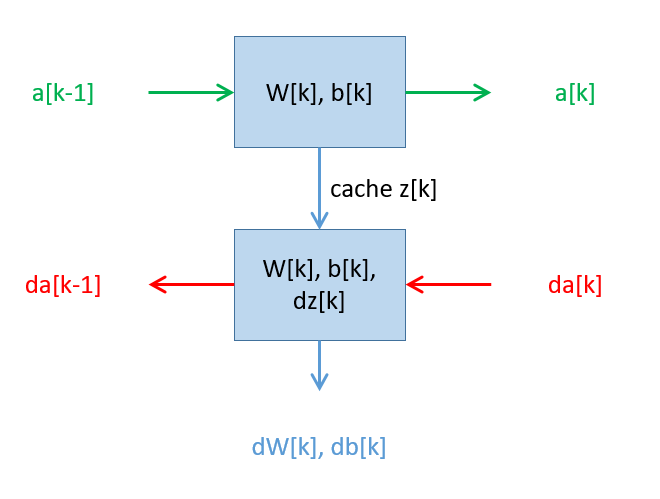
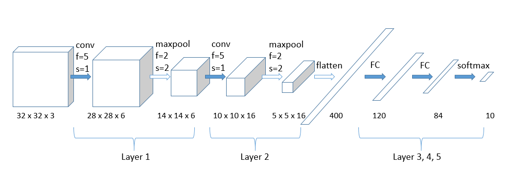
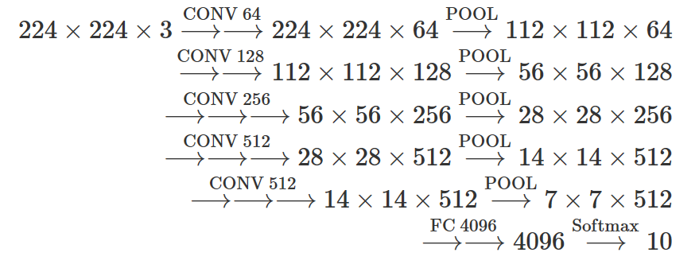
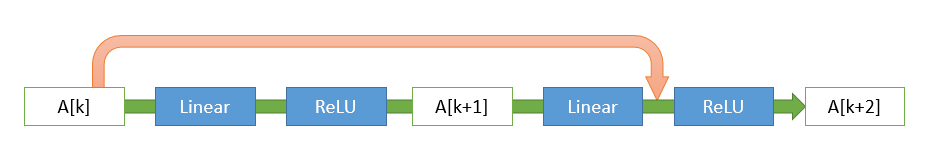
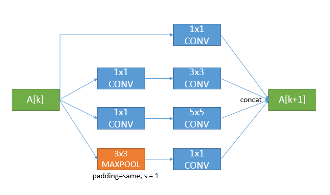
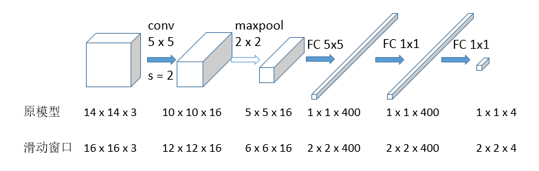

本文是我对 Andrew Ng 的深度学习专项课程的学习笔记。这一系列课程是深度学习入门必修课，完整课程（视频、作业等）请在 deeplearning.ai 或 Coursera 访问。

借这门课，复习了入门知识，特别是徒手推导出了几乎所有算式；复习了经典论文；有时间希望能补完编程作业。这里记录一些我觉得重要的内容，例如自然语言处理比较熟就省略一些，图像处理比较不熟就多写一些，方便以后复习。

## 神经网络和深度学习

深度学习的进步，受益于更多数据（特别是标注数据）和更大模型，以及更快算法（例如将 sigmoid 换成 relu）。

最佳实践是打通并且加速 idea --> code --> experiment --> idea 的循环。

### 神经网络基础

假设有 $m$ 个训练样本，每个样本输入 $x^{(i)}$ 为 $n_X$ 维向量，输出 $y^{(i)}$ 为 0 或 1。将每个样本作为一个列向量，整个训练集 $X \in \mathbb{R} ^{n_X \times m}$，$Y \in \mathbb{R} ^{1 \times m}$。

> 提醒：使用 numpy 要小心 1d array 可能有坑，建议统统 reshape(-1, 1) 或 reshape(1, -1) 以转化为 2d array。

我们希望学习 $\hat{y} = p(y=1|x)$。采用 logistic regression 模型
$$\hat{y} = \sigma (w ^ \top x + b)$$
其中 $\sigma(z) = \frac{1}{1+e^{-z}}$ 称为 sigmoid 函数。

为训练参数 $w, b$，定义 loss 和 cost 函数，它必须有效使 $\hat{y}$ 接近 $y$，为了方便优化，一般我们希望它是凸的（convex）。这里我们定义
$$\mathcal{L}(\hat{y}, y) = - (y \log \hat{y} + (1-y) \log (1- \hat{y}))$$
$$J(w, b) = \frac{1}{m} \sum_{i=1, \ldots, m} \mathcal{L}(\hat{y}^{(i)}, y^{(i)})$$

> 这个 cost 函数的动机是，由于 $p(y=1|x) = \hat{y}$，$p(y=0|x) = 1-\hat{y}$，两种情形等价于 $p(y|x) = \hat{y} ^y (1-\hat{y})^{1-y}$。

为了最小化 $J$，我们采用梯度下降法，对每个参数重复 $w \leftarrow w - \alpha \frac{\partial J}{\partial w}$，直到收敛（或者其他终止条件）。

多数神经网络的训练都借助计算图（实际是一棵树），每个节点是一个参数或中间变量，最终节点是 $J$，前向过程由参数计算 $J$，后向过程用链式法则计算各个 $\frac{\partial J}{\partial w}$。

对于一批 $m$ 个样本，可以用 for 循环，分别计算每个样本的 $\frac{\partial \mathcal{L}}{\partial w}$，然后求和得到 $\frac{\partial J}{\partial w}$。但循环计算效率低。需要熟悉 vectorization 以及 broadcasting，采用向量化方式并行计算。

以 logistic regression 为例，容易推导出单个样本的梯度计算是 
$\frac{\partial \mathcal{L}(\hat{y}, y)}{\partial w_i} = x_i (\hat{y} - y)$；
一批样本的梯度向量化计算是 $\frac{\partial J}{\partial w} = \frac{1}{m} X (\hat{Y} - Y)^\top$。

> 不会推导似乎也不妨碍你去做开发，但是只要掌握简单的多元微分和矩阵计算，按照链式法则手动推导前馈神经网络的反向传播并不难。

如果上下文不会引起混淆，我们简写 $\frac{\partial \mathcal{L}(\hat{y}, y)}{\partial w}$ 或者 $\frac{\partial J}{\partial w}$ 为 $dw$。

### 单隐层神经网络

两层神经网络的结构

- 一个输入层： $a^{[0]} = x$ （列向量）
- 一个隐层： $z^{[1]} = W^{[1]\top}a^{[0]} + b^{[1]}$, $a^{[1]} = \sigma(z^{[1]})$
- 一个输出层：$z^{[2]} = W^{[2]\top}a^{[1]} + b^{[2]}$, $a^{[2]} = \sigma(z^{[2]})$, $\hat{y} = a^{[2]}$

> 神经网络的层号上标一般用小写字母 $l$，但是我使用 $k$ 避免混淆。

一批样本，一层的向量化前向计算是 $Z^{[k]} = W^{[k]\top}A^{[k-1]} + b^{[k]}$，$A^{[k]} = \sigma(Z^{[k]})$；梯度后向计算是 $dZ^{[2]} = A^{[2]} - Y, dW^{[k]} = dZ^{[k]} A^{[k-1]\top}, db^{[k]} = dZ^{[k]}$。

> 类似于物理学的量纲推导，这里也可以借助 array shape 来推导。

激活函数（activation function）有很多选择

- sigmoid $g(z) = \frac{1}{1+e^{-z}}$，值域为 (0, 1)，适合二分类时将 logits 变为概率
- tanh $g(z) = \frac{e^z-e^{-z}}{e^z+e^{-z}}$，值域为 (-1, 1)，使数据变为 0 均值，通常有利于下一层的学习
- ReLU $g(z) = \max(0, z)$，不会像 sigmoid 和 tanh 那样容易饱和导致梯度趋于 0，因此通常训练较快
- leaky ReLU $g(z) = \max(0.01z, z)$，与 ReLU 相似，但是负半轴上梯度也不会为 0

为什么要使用非线性的激活函数？因为如果是线性的激活函数，或者不使用激活函数，几层前馈神经网络都等价于一个线性变换。为什么选择 sigmoid 和 tanh？很大的好处是它们的导数值可以由函数值计算

- sigmoid $g'(z) = g(z) \cdot (1-g(z))$
- tanh $g'(z) = 1 - g^2 (z)$

如何初始化参数？在前馈层中，$b$ 初始化为 0 没有影响，但是 $W$ 如果初始化为 0，那么所有神经元的贡献相同，反向传播也不会打破这种对称性。此外如果参数值较大，那么激活函数更可能饱和，从而梯度下降效果更差。因此建议 $W$ 初始化为很小的随机数。

### 深层神经网络

为什么要使用深度学习，即深层神经网络？简单直观解释，如果有许多隐藏层，一开始的若干层可以检测到浅层、局部、简单的特征，而后面的层可以整合这些特征，识别出更复杂的特征。

并且，存在某些函数，用深层神经网络可以用较少的神经元计算它，而使用浅层神经网络时需要指数量级的神经元数量，例如计算 $n$ 个输入的异或：x_1 XOR x_2 XOR ... XOR x_n，用 $\log(n)$ 层计算它，神经元个数为 $O(n)$；用一层计算它，神经元个数为 $O(2^n)$。

多层的前馈神经网络与单隐层网络在前向、反向传播方面是相似的。这里我们将每一层抽象出来：

<div align="center"><figure>
  
  <figcaption>神经网络中的一层，具有前向、后向函数</figcaption>
</figure></div>

- 前向输入 $a^{[k-1]}$
- 参数 $W^{[k]}, b^{[k]}$，激活函数 $g^{[k]}$
- 前向输出 $a^{[k-1]}$ 传给下一层，同时为了方便计算，缓存 $z^{[k]}$
- 前向计算：$z^{[k]} = W^{[k]\top}a^{[k-1]} + b^{[k]}$, $a^{[k]} = g^{[k]}(z^{[k]})$
- 后向输入 $da^{[k]}$
- 后向输出 $da^{[k-1]}, dW^{[k]}, db^{[k]}$
- 后向计算：$dz^{[k]} = da^{[k]} \circ g^{[k]\prime} (z^{[k]}), dW^{[k]} = dz^{[k]} a^{[k-1]}, db^{[k]} = dz^{[k]}, da^{[k-1]} =  W^{[k]\top} dz^{[k]}$
- 参数更新：$W^{[k]} \leftarrow W^{[k]} - \alpha \cdot dW^{[k]}, b^{[k]} \leftarrow b^{[k]} - \alpha \cdot db^{[k]}$$

除了参数以外，超参数也是重要的，例如参数更新使用的学习率 $\alpha$ 和 momentum；迭代次数，隐层数，每层的神经元数，minibatch size；激活函数，正则项……这些将在下一门课中讲解。

## 2 改进深层神经网络

### 正则化

首先以 logistic regression 为例，原本优化目标是 $\min_{w,b} J(w,b)$，其中 $J(w, b) = \frac{1}{m} \sum_{i=1, \ldots, m} \mathcal{L}(\hat{y}^{(i)}, y^{(i)})$。

L1 和 L2 正则化就是给代价函数增加正则项。

L2 正则项是 $\frac{\lambda}{2m} \lVert w \rVert_2^2 =\frac{\lambda}{2m}w^{\top}w$。用下标 L2 表示加正则项后的相关元素，则第 $k$ 层有 $dW_{L2}^{[k]} = dW^{[k]} + \frac{\lambda}{m} W^{[k]}$，因此梯度下降时 
$$W^{[k]} \leftarrow W^{[k]} - \alpha \cdot dW_{L2}^{[k]} = (1 - \frac{\lambda}{m})W^{[k]} - \alpha \cdot dW^{[k]}$$
相当于除了梯度下降以外，还会迫使权重乘以系数 $(1 - \frac{\lambda}{m})$，从而参数值倾向于变小。因此，L2 正则化也被称为权重衰减（weight decay）。

为何权重衰减会有防止过拟合的效果？一个直观的解释是，例如 tanh 这样的激活函数在 $z=0$ 附近是接近于线性的，因此当 $W$ 数值很小时，$z$ 数值倾向于接近 0，每一层接近于线性，从而整个模型更接近于一个简单的线性模型，降低模型的复杂度。

L1 正则项是 $\frac{\lambda}{2m} \lVert w \rVert_1 =\frac{\lambda}{2m}\sum_{i,j} \lvert w_{i,j }\rvert$，效果是使参数稀疏化。

为何 L1 正则化会有稀疏化的效果？课上一般将它直接当成显然的结论。网上普遍使用一幅图来直观说明，代价函数的等高线与 L1 函数的多面体的切点更可能在后者的顶点处。我认为用公式也很直观：绝对值函数对于正、负数的导数分别为 +1、-1；在非零点处，第 $k$ 层有 $dW_{L1}^{[k]} = dW^{[k]} + \frac{\lambda}{m} \mathrm{sgn} W^{[k]}$，因此梯度下降时
$$W^{[k]} \leftarrow W^{[k]} - \alpha \cdot dW_{L1}^{[k]} = W^{[k]} - \alpha \cdot dW^{[k]} - \alpha \frac{\lambda}{m} \mathrm{sgn} W^{[k]}$$
会使参数趋向于 0。

> 绝对值函数在零点处的导数是无定义的，当然这个问题有各种解决方式，这里不深究。

另一种正则化手段是 dropout，随机去掉一些神经元和相应的连接，这样避免输出过于依赖某一个特征。通常编程实现是 inverted dropout，在训练时 drop 和 scale，而预测时不做任何处理：
```python
# 对第 3 层做 dropout，随机保留的概率为 keep_prob
d3 = np.random.rand(a3.shape[0], a3.shape[1]) < keep_prob # 布尔值或 0/1
a3 = np.multiply(a3, d3)  # point-wise 乘法，随机去掉一些神经元
a3 /= keep_prob  # 放缩，使 z 的大小期望大致差不多，不受丢掉神经元的影响

```
按照原论文，dropout 其实也近似于从原模型通过随机去掉神经元产生指数多个模型，它们的预测结果加权平均。一般来说，dropout 加在参数量特别大的层上。

此外，还可以通过翻转、裁剪等进行数据扩增；或者采用 early stopping 策略，同时看训练集和开发集的误差，当开发集误差不再下降时停止训练，而不是等训练集误差一直下降，从而避免对训练集过拟合。

注意，early stopping 属于 orthogonalization：同时考虑不止一个目标，既要优化代价函数，又要避免过拟合，这样可能会导致超参数很难调。如果只使用 L2 regularization，那么就只用一个手段达到两个目的，调节超参数更方便，但是计算量要大一些。

### 梯度问题

一个重要的策略是，对输入进行 normalize：通过线性放缩使之分布变成均值为 0，方差为 1，减小不同特征及其梯度的尺度差异。

以前，深度学习的一大困难是梯度爆炸、梯度消失。在不使用非线性激活函数的情况下，深层的神经网络意味着多个参数矩阵连乘，使整个变换或者梯度变成指数级的，指数增加即梯度爆炸，指数减小即梯度消失，因而很难学习深层网络。

为避免梯度爆炸，可以在随机初始化时控制参数的均值为 0，方差不要太大，如果输入特征个数（即前一层神经元个数）为 $n$，往往采取方差为 $\frac{1}{n}$ （激活函数 ReLU 时可以采用 $\frac{2}{n}$），那么输出会更可能接近于 1。

> 这种初始化的变体是 Xavier 初始化，方差为 $\frac{2}{n^{[k-1]} + n^{[k]}}$。在 keras 中，正态分布的 Xavier 初始化称为 glorot_normal；均匀分布则称为 glorot_uniform，是默认的参数初始化方式。

建议在一开始 debug 时进行 gradient check，通过 $\frac{J(\theta_1, \ldots, \theta_i + \epsilon, \ldots, ) - J(\theta_1, \ldots, \theta_i - \epsilon, \ldots, )}{2 \epsilon}$ 近似 $\frac{\partial J}{\partial \Theta_i}$，检查是否有些维度差异过大。

### 优化

通常我们将训练集划分为多组，对每组（batch）批量计算梯度，在较小的 mini-batch 而不是整个训练集上进行梯度下降，因此称为 mini-batch gradient descent。每次批量计算一组样本（batch）称为一个 iteration，整个训练集跑一遍称为一个 epoch。

- 如果 batch size 为整个训练集大小 $m$，则 1 epoch 只包含 1 iteration，就退化为 batch gradient descent，每次迭代计算太慢
- 如果 batch size 为 1，则 1 epoch 包含 $m$ iterations，就变为 stochastic gradient descent，失去了使用向量化并行计算的意义
- 实际操作中，如果训练集较大，通常会选择一个适中的 batch size，例如 64, 128, 256, 512

优化器改进的一个出发点是指数加权移动平均值（ewm），即对于序列数据 $x_1, \ldots, x_T$，计算 $v_t = \beta v_{t-1} + (1-\beta) x_t$，这样的均值可以积累历史数据同时捕捉到最新的变动情况。

这等价于 $v_t = (1-\beta)(x_t + \beta x_{t-1} + \cdots + \beta^t x_1)$。如果初始化 $v_0 = 0$，那么初始的 $v_1, v_2, \ldots$ 就会偏小，可以用乘以 $\frac{1}{1 - \beta^t}$来修正。当 $t$ 足够大时，这个修正因子就接近于 1，可以去掉。

因为 $1-\beta$ 通常很小，所以有 $\beta ^{\frac{1}{1-\beta}} \rightarrow \frac{1}{e}$，换言之在 $\frac{1}{1-\beta}$ 个周期之前的数据的权重小于一个固定值。$\beta$ 越接近于 1，保留的历史信息就越久；反之，对新数据的适应就越快。

梯度下降 + momentum：对历史和当前梯度计算 ewm，而不是只用当前时刻的梯度，从而减少来回振荡
$$v \leftarrow \beta v + (1-\beta) dw, \quad w \leftarrow w - \alpha v$$

RMSprop：每个维度分别放缩步长，如果某个维度历史振荡更大，当前更新的步长会缩小，从而减少其振荡，允许用更大的学习率，更快地收敛
$$s \leftarrow \beta s + (1-\beta) (dw)^2, \quad w \leftarrow w - \alpha \frac{dw}{\sqrt{s}}$$

> 上式中 $(dw)^2$ 是 element-wise square，每个元素分别平方。另外实际操作中为了避免分母为零，因此分母实际上是 $\sqrt{s+\epsilon}$。顺便一提，Andrew Ng 说，RMSprop 广为人知的契机其实是因为 Hinton 在 Coursera 开课……

> RMSprop 实际上是 AdaGrad 的升级版。RMSprop 计算的是加权平均，而 AdaGrad 直接求和，导致最后式子中的分母单调增大，步长变得很小，出现类似于梯度消失的问题。

Adam：结合了 momentum 和 RMSprop 两者，同时加入了对前几项的修正因子
$$v \leftarrow \beta_1 v + (1-\beta_1) dw, \quad \hat{v} =\frac{v}{1-\beta_1^t}$$
$$s \leftarrow \beta_2 s + (1-\beta_2) (dw)^2, \quad \hat{s} =\frac{s}{1-\beta_2^t}$$
$$w \leftarrow w - \alpha \frac{\hat{v}}{\sqrt{\hat{s}}}$$

随着学习逐渐进行，假设大体方向已经无误，我们自然希望步长缩短，更精细地找到最小值。学习率衰减有几种方式，例如按照递降的公式直接计算，或者是离散阶梯式下降，或者是观察到平台后手动修改学习率。

优化的目标是找到全局的极小值。但是梯度接近零并不一定是全局极值：局部极小值一般不是大问题；鞍点也有办法逃离；平台会比较困难。

### batch norm

之前已经提到过，对输入进行 normalize 有助于加速学习。在深度学习中，我们希望对隐层的输入也做 normalize。实践中，这一步一般位于激活层之前。对于某一层的输出 $z_1, \ldots, z_m$（省略了层号），我们计算均值 $\mu$ 和方差 $\sigma^2$，并引入两个可以通过反向传播学习的参数 $\gamma, \beta$，计算
$$z_{\mathrm{norm}} = \frac{z - \mu}{\sqrt{\sigma^2+\epsilon}}, \quad \tilde{z} = \gamma z_{\mathrm{norm}} + \beta$$
我们在一个 mini-batch 中，用 $\tilde{z}$ 取代原来的 $z$，这就是 batch norm。假如 $\gamma=\sqrt{\sigma^2+\epsilon}$，$\beta=\mu$，那么实际上 $\tilde{z}=z$。引入两个参数，是为了确保它们学到一个固定的均值和方差，但不强制这个均值和方差就是 0 和 1，因为均值 0、方差 1 可能并不适用于后面的激活函数。

> 在 batch norm 之前的前馈层，不需要 bias，因为它与 $\beta$ 相互耦合。

为什么 batch norm 有用？从某一个隐层的角度来看，经过一批训练之后，虽然它学习到了新的参数，但是它之前的层也学习到了新的参数，所以这个隐层的输入数据的分布就会发生变化（covariant shift），导致它可能需要重新学习。而 batch norm 的作用是减少这种分布的变化，使之具有相对固定的均值和方差，因此参数的更新就相对独立和稳定。此外，只基于 mini-batch 计算均值和方差，相当于引入了噪声，起到类似 dropout 的正则效果。

测试时，如何估计 $\mu, \sigma^2$ 并计算出 $\tilde{z}$？在训练时，每一个 mini-batch 都有对应的 $\mu, \sigma^2$；在测试时，用之前若干个 mini-batch 的 $\mu, \sigma^2$ 的指数权重均值即可。 

### 超参数

超参数非常多，调参的大致优先级顺序：

- 学习率 $\alpha$
- 动量 $\beta$，mini-batch size，隐层神经元数
- 层数，学习率衰减

传统机器学习可能习惯 grid search，但是深度学习建议对超参数的组合随机采样，这样每一个超参数都能尝试更多的值。然后缩小搜索区域，细化超参数组合。注意对于学习率之类超参数，应该在对数尺度上而不是线性均匀随机采样。

最后，关于深度学习框架，现在有许多选择，但是建议关注以下三点：

- 编程简便，容易开发，容易部署
- 运行的速度
- 预测会长期真正开放，不仅仅是目前开源，而且要有靠谱的监管，避免某家公司垄断之后未来变成闭源的

## 3 机器学习项目构建

大部分内容与 [Machine Learning Yearning](https://sighsmile.github.io/2018-10-06-machine-learning-yearning) 重复，不再赘述。

> 我的 Machine Learning Yearning 笔记：https://sighsmile.github.io/2018-10-06-machine-learning-yearning

训练、调试和改进模型时，我们希望采取的调节手段是正交的（orthogonal），针对某个特定问题，而不是耦合的。例如，early stopping 就不是正交的手段，因为它导致的结果没法分离和定位到具体问题。

## 4 卷积神经网络

### CNN 基础

我已经详细整理过[卷积计算基础](https://sighsmile.github.io/2018-07-29-conv-arithmetic/)，在此不再赘述。

> 我的卷积计算笔记：https://sighsmile.github.io/2018-07-29-conv-arithmetic

为了检测竖直边缘（例如照片中的栏杆），我们使用一个滤波器矩阵 $[[1, 1, 1]^\top, [0, 0, 0]^\top, [-1, -1, -1]^\top$，对灰度图片矩阵分别做卷积，即滑动经过每个同样大小的区域，对应位置元素相乘再求和。早期的图像处理需要花很多时间设计这样的滤波器来提取特征，但是现在使用卷积神经网络，可以通过反向传播自动学习这些滤波器。

严格来说，深度学习中所谓的卷积其实是 cross-correlation，比 convolution 少了一步，即水平翻转并竖直翻转。

常用的卷积是二维卷积（conv2d）。

如果输入的尺寸为 $n_H \times n_W$，卷积核的尺寸为 $f \times f$，步长为 $s$，边缘补零个数为 $p$，则输出的尺寸为 $\lfloor{\frac{n_H+2p-f}{s} + 1}\rfloor \times \lfloor{\frac{n_W+2p-f}{s} + 1}\rfloor$。

如果输入的尺寸为 $n_H \times n_W \times n_C$，卷积核的尺寸为 $f \times f$（其实是 $f \times f \times n_C$，但是省略最后一项），例如 RGB 图片，通道数 $n_C=3$，卷积输出的尺寸仍然是 $\lfloor{\frac{n_H+2p-f}{s} + 1}\rfloor \times \lfloor{\frac{n_W+2p-f}{s} + 1}\rfloor$，其中每一个位置是由 $f \times f \times n_C$ 次乘法计算得到的。如果使用 $n_F$ 个卷积核，那么它们的输出的尺寸就是 $\lfloor{\frac{n_H+2p-f}{s} + 1}\rfloor \times \lfloor{\frac{n_W+2p-f}{s} + 1}\rfloor \times n_F$。事实上，这样的卷积一般写成是 $f \times f \times n_F$。

注意卷积层是有 bias 的，所以参数个数是 $(f \times f \times n_C + 1) \times n_F$。

卷积网络中通常除了卷积层还会使用全连接层和池化层。

全连接层其实就是每个神经元都与输入全体神经元相连接。如果输入的形状是 $n_H \times n_W \times n_C$，那么采用 $n_F$ 个 $n_H \times n_W$ 的卷积核，其实就相当于是一个神经元个数为 $n_F$ 的全连接层。

池化层与卷积层类似，滑动经过的每个区域都计算出一个元素，因此池化层也有尺寸 $f$ 和步长 $s$ 这两个参数，输出尺寸为 $\lfloor{\frac{n_H+2p-f}{s} + 1}\rfloor \times \lfloor{\frac{n_W+2p-f}{s} + 1}\rfloor \times n_C$（注意池化一般不跨过不同通道）。只不过卷积层计算的是区域各元素的线性组合，线性组合的系数是要学习的参数；而最大池化（max pooling）直接取区域的最大元素，平均池化（average pooling）是计算各元素的平均值，池化层没有待学习的参数。

> 正如我之前说过的，池化其实是个很糟糕的翻译，pool 作为动词的意思其实是聚拢、集中，例如 pool ideas and information（集思广益、共享信息）、pool resources（聚合资源、通力合作）。所以我认为翻译为聚合层更合适。

卷积神经网络的优点是共享参数和稀疏连接，特征检测器（卷积核）可以复用，每个输出只依赖于小部分输入，所以能够捕捉局部特征。一般来说，随着层数加深，$n_H, n_W$ 会变小，而 $n_C$ 会增加，可以看成是信息从原始空间转移到通道维度，从空域转换到频域。

### 经典的深层 CNN 模型

在计算卷积神经网络的层数时，一般只算卷积层和全连接层，不算池化层。

<div align="center"><figure>
  
  <figcaption>LeNet-5 模型（蓝色箭头表示卷积层和全连接层）</figcaption>
</figure></div>

图示的 LeNet 模型是现代版的，与原始论文有细微区别，例如原论文中在池化层后是 sigmoid 非线性激活，那时候也没有对卷积补零的概念。

AlexNet 与 LeNet 类似，也是使用不同大小的卷积核逐步提取特征，由于层数和特征维数更多，模型参数从大约六万变成了约六千万。

VGG 模型将复杂的核尺寸简化为只有一个尺寸：卷积核 $3 \times 3$，步长为 1，补零使输出与输入尺寸相同（same padding）；最大池化 $2 \times 2$，步长为 2，输出边长为输入的一半。VGG 16 模型结构如下：

<div align="center"><figure>
  
  <figcaption>VGG 16 模型（连续箭头表示相同结构的层）</figcaption>
</figure></div>

理论上，假设参数可以充分学习，增加网络层数应该能提升表征能力；现实中，由于梯度爆炸或消失问题，阻碍模型训练，增加网络层数有时反而导致训练集上的指标下降。一种解决技巧是残差块（residual block），引入一条近路，从 $k$ 层出发，不经过第 $k+1$ 层，直接连到第 $k+2$ 层的激活层之前。$A^{[k+2]} = g(Z^{[k+2]})$ 变成了 $A^{[k+2]} = g(Z^{[k+2]} + A^{[k]})$。如果两层的尺寸不匹配，就适当补零，或者对 $A^{[k]}$ 乘一个适当大小的矩阵。

<div align="center"><figure>
  
  <figcaption>残差（绿色箭头是主路，红色箭头是残差引入的近路）</figcaption>
</figure></div>

为什么残差有希望提升深层网络的效果？不妨考虑极端情形，如果第 $k+1$ 层是零变换，那么第 $k+2$ 层就和第 $k$ 层相同。换言之，残差块可以保证增加网络层数至少不损害模型表征能力。ResNet 就是在深层网络中增加了许多这样的残差块，因此能够训练非常深的网络。

另一个有用的结构是 $1 \times 1$ 卷积。如果使用 $n_F$ 个卷积核，就将 $n_H \times n_W \times n_C$ 的输入转变为 $n_H \times n_W \times n_F$ 的输出，不但对通道数量进行了放缩，还增加了非线性变换。再次提醒，对于三维输入，它将跨越多个通道的值合并为一点，相当于引入许多个跨越多个通道的局部隐层，因此这种结构也称为 network in network。

使用 $1 \times 1$ 卷积，可以减少模型计算量。如果输入尺寸为 $28 \times 28 \times 192$，希望输出尺寸为 $28 \times 28 \times 32$，直接做 $5 \times 5$ 卷积，卷积核的参数数量为 $5 \times 5 \times 192 \times 32 = 153,600$，需要做的乘法数量为 $28 \times 28 \times 153,600 = 120M$；如果先做 $1 \times 1$ 卷积将频道数缩减到 16，然后再做 $5 \times 5$ 卷积，那么总共的乘法数量为 $28 \times 28 \times 192 \times 16 + 28 \times 28 \times 16 \times 5 \times 5 \times 32 = 12.4M$。中间这一层称为瓶颈（bottleneck），这个技巧使乘法次数减少为原来的十分之一。

Inception 模块的思路是，不再纠结到底应该用什么尺寸的卷积核，而是将 $1 \times 1$ 卷积、$3 \times 3$ 卷积、$5 \times 5$ 卷积、最大池化层统统用上，让它们都输出相同长宽尺寸的结果，沿着通道维度拼接在一起。使用上述的瓶颈技巧，减少计算代价。

<div align="center"><figure>
  
  <figcaption>Inception 模块</figcaption>
</figure></div>

Inception 网络由许多上述模块构成，此外还引入了中间输出，即从中间的某一层经过全连接和 softmax 进行预测，以保证模型的前面若干层也在正确的方向上。

> Inception 模型又称为 GoogLeNet，以表示向 LeNet 的致敬。Inception 则得名于电影《盗梦空间》，其中有一句台词是 We need to go deeper :-)

### 实践建议

在图像分类领域，论文复现和从头开始训练模型有时较为困难，迁移学习是值得鼓励的做法，利用别人文献发布的网络架构、模型的开源实现、预训练的权重。假如自己的数据集非常小，那么可以下载别人在大型数据集上训练好的模型，去掉最后一层 softmax，换成自己的 softmax 和类别，只在自己的小数据集上训练最后一层参数。之前所有层的参数冻结（如果自己的数据够多，也可以少冻结几层），作为预训练好的特征提取器。事实上，可以将小数据集上每张图像的特征提取出来再训练一个小得多的模型，这种预计算技巧可以加速训练。

数据扩充是一种重要的手段，主要包括镜像（水平翻转）、裁剪、color shifting（对 RGB 数值增加微小噪声）。实践中，一般是有专门的 CPU thread 载入图像、进行变形处理、传给其他 thread 用于训练。

在设计和训练模型时，我们实际上有两种知识源：标注数据；人工的特征工程、手动设计的网络结构等。如果数据充足，简单的算法或网络就够了；否则就需要特征工程之类的 hacks，或者借助迁移学习。

一些技巧可以提升论文效果和竞赛排名，但未必适用于业界生产（我感觉主要是因为拖慢速度）：

- ensembling，模型组合，多个模型对同一个测试数据做预测，预测结果加权平均
- multi-crop，在测试时做数据扩充，对同一个测试数据扩增后的多个数据做预测，结果加权平均

### 物体检测

对于图像分类任务，网络的最终输出用一个 softmax 即可，预测相应的标签。以道路场景为例，我们关心三类物体：汽车、摩托车、行人。所以如果是图像分类，标签为 $y = [c_0, c_1, c_2, c_3]^\top$，分别对应于背景、汽车、摩托车、行人，例如图中有一辆车，标签为 $y = [0, 1, 0, 0]^\top$。

如果是分类+定位（localization）任务，还需要返回物体边框（bounding box）的坐标，可以用 4 个数值表示。标签为 $y = [p_c, b_x, b_y, b_h, b_w, c_1, c_2, c_3]^\top$，分别对应于是否有物体、物体边框中心横坐标、纵坐标（归一化到 0 和 1 之间）、边框高度、宽度（与边长的比例）、物体是否为汽车、摩托车、行人。例如图中有一辆车，标签为 $y = [1, 0.4, 0.3, 0.6, 0.6, 1, 0, 0]^\top$；如果图中没有人或车，标签为 $y = [0, .....]^\top$，后面的内容我们不关心。即标签长度为 $5+n_c$，其中 $n_c$ 为物体类别个数。

此时如何计算 loss？要根据真实标签，分两类计算（不同类型的输出可以有不同的 loss 函数 $L_i$）：
$$\mathcal{L}(\hat{y}, y) = \sum_{i=1}^8 L_i(\hat{y_i}, y_i) \quad\mathrm{if}\ y_1 = 1$$
$$\mathcal{L}(\hat{y}, y) = L_1(\hat{y_1}, y_1) \quad\mathrm{if}\ y_1 = 0$$
通过这样定义标签和 loss，可以建立端到端、多任务的模型。

以上任务中，一般一张图只有一个中心物体待识别。物体检测 object detection 是要检测不止一个目标物体并输出它们各自的边框。另一种任务是 landmark detection，要检测并输出多个特征点的坐标，例如表情或者姿势检测需要输出人脸或人体的多个特征点的坐标。这些任务也可以用类似上面的方法去定义标签。

如果训练数据是经过裁剪的小图，每幅图以物体为中心，以物体边框为图像外框，没有多余背景；而待检测图像较大，其中可能包含多个物体，该如何检测物体并给出边框？简单的想法是滑动窗口并裁剪图片，依次检测每个滑动窗口。但是这样循环计算的效率太低。全卷积网络（前面已经说过全连接层和池化层都可以改写成卷积）本身就是滑动窗口权值共享，所以可以借助卷积来计算滑动窗口。原模型是在 $14 \times 14 \times 3$ 的输入上训练的；现在对于 $16 \times 16 \times 3$ 的输入和步长为 2 的滑动窗口，它给出 $2 \times 2$ 的结果。因为卷积网络具有速度优势，这样的模型可以支持实时检测。

<div align="center"><figure>
  
  <figcaption>用卷积来计算滑动窗口</figcaption>
</figure></div>

如何评估边框的预测值的准确程度，或者说它和标注值的偏离程度？一般使用 IoU（Intersection over Union）作为指标，计算交集和并集的面积比值（其实就是 Jaccard 相似度），超过某个阈值（例如 0.5）就算是正确。

如果实际图像中的物体边框比例有变形，如何给出更精准的预测？将图像划分为多个区域，图中的物体的中心落在哪块区域就认为它属于哪块区域，对每一块区域用类似上面的方法定义标签（如果边框超出当前区域，$b_h, b_w$ 可以大于 1）。例如划分为 $19 \times 19$ 小区域，总的输出形状就是 $19 \times 19 times 8$。

如果预测出相互重叠的边框，但它们实际上对应的都是同一个物体，如何去掉重复？对于预测出的边框和物体，进行 non-max suppression：

- 对于每一类物体：
    - 首先去掉 $p_c$ 低于阈值（例如 0.6）的预测候选边框
    - 如果有剩余的边框，重复：
        - 选择当前 $p_c$ 最高的边框作为实际输出
        - 计算其他边框与它的 IoU，去掉超过阈值（例如 0.5）的重叠边框

如果两个物体中心部分接近，用上面的方法只能预测出其中一个，如何将两者都预测出来？可以引入 $n_a$ 个具有不同的固定长宽比的 anchor box（例如 5 个），图像中每个物体实例都对应于一个边框形状最接近的 anchor box，并修改标签为 $n_a \times 8$ 维而不是 $8$ 维。

将上面的方法按次序结合起来，就是 YOLO（You Only Look Once）物体检测算法。

其他物体检测算法例如 R-CNN，首先运行分割算法，提议出候选区域，然后对每个区域进行准确的物体检测，所以比较慢。Fast R-CNN 算法将物体检测部分改用前述的卷积网络实现，速度得以提升。Faster R-CNN 算法将提议候选区域部分也改为卷积网络，速度进一步加快。YOLO 算法只需要一步而不是分两步完成，具有明显的速度优势。

### 人脸识别

首先注意区分 face verification（1-1 人脸比对，输出为人脸和人是否匹配）和 face recognition（1-K 人脸识别，输出为人脸和数据库中哪个人匹配）。其他要点包括：活体检测，能区分活人和照片；one-shot learning（一次学习），使用单个样本就能学习一个标签；等等。

关于 one-shot learning，解决方法是学习一个距离（相似度）函数，用两幅图之间距离是否大于指定阈值来进行 1-1 比对，用当前图与数据库中所有图的距离排序来进行 1-K 识别。

为此，采用 Siamese network 架构，复用一个编码器，对当前图和数据库中的图分别进行编码并生成特征，将两个特征向量之间的某种距离作为两幅图的距离。对图像 $x^{(1)}, x^{(2)}$，特征向量分别为 $f(x^{(1)}), f(x^{(2)})$，距离可以定义为
$$\hat{y} = d(f(x^{(1)}), f(x^{(2)})) = \sigma \left(\sum_i w_i \lvert f(x^{(1)})_ i - f(x^{(2)})_ i \rvert \right)$$
类似于 logistic regression，可以学习权重系数；也可以采用其他定义例如 L2 距离，$\chi^2$ 距离。

总之，只要是两幅图来自同一个人，距离应该很小；来自不同的人，距离则较大。用 A、P、N 分别代表锚、正例（与锚是同一个人）、反例（不同的人），采用三元组方式定义 triplet loss 或约束条件：
$$d(A, P) - d(A, N) \leq 0$$

但是上式有一个退化的平凡解，即所有 $f(x)$ 都相同，因此距离都为 0。为了避免收敛到这个解，加强约束，增加一个 margin（类似于 SVM）：
$$d(A, P) - d(A, N) \leq 0 - \tau$$
$$\mathcal{L} (A, P, N) = \max ( d(A, P) - d(A, N) + \tau, 0)$$

采用 triplet loss 时，训练集不能是 one-shot，必须有同个人的至少两个样本才能构成三元组。此外，三元组的选取方式不宜是完全随机的，而应该侧重于那些更难分离的三元组。编码器部分可以选取预训练的模型并冻结参数；事实上甚至可以将所有特征向量都预计算出来。

> 人脸识别部分介绍得较简略，具体可以阅读 DeepFace, FaceNet 等论文，这些论文一般都有 github 开源代码和模型。实践中各种各样的 loss 也是研究重点，这里只介绍了最简单的情形。

### 风格迁移

如何对卷积网络进行可视化？选择一个神经元，从数据集中找到使得该神经元激活值最大的那些窗口。 

风格迁移（style transfer）是指，两幅图 C 和 S 分别提供内容和风格，生成二者融合的图像 G，内容接近 C 但风格类似 S。代价函数为 $J(G) = \alpha J_C (C, G) + \beta J_S (S, G)$。这不是一个有监督的问题，所以我们使用预训练的卷积模型。

如何衡量内容是否接近？我们取一个模型中不太靠后的隐层，计算两幅图在这一层的激活值是否相近。例如取 VGG 网络中的第 $l$ 层的激活值，定义 
$$J_C^{[l]} (C, G) = \frac{1}{2} \lVert a^{[l](C)} - a^{[l](G)}  \rVert^2$$

如何衡量风格是否类似？我们认为卷积网络的隐层的神经元可以捕获到风格信息，不同的神经元被不同的风格要素激活。那么一幅图的风格可以用同一层中不同通道激活值之间相关性刻画。取模型中的第 $l$ 层，计算一幅图在这一层的激活值的 Gram 矩阵 $M_{n_C^{[l]} \times n_C^{[l]}}^{[l]}$，定义 
$$J_S(S, G) = \sum_l \lambda^{[l]} J_S^{[l]}(S, G) ,\quad J_S^{[l]}(S, G) = \frac{1}{(2n_H^{[l]}n_W^{[l]}n_C^{[l]})^2} \lVert M^{[l](S)} - M^{[l](G)}  \rVert^2$$
其中 $M_{k,k'}^{[l]} = \sum_{i,j} a_{i,j,k}^{[l]}a_{i,j,k'}^{[l]}$，$\lambda^{[l]}$ 是超参数。

如何生成风格迁移的合成图像？首先随机初始化 G，然后使用上面的 loss，用梯度下降或其他优化方法逐步修改 G。当然这只是一种方法，不是唯一的思路。

### 一维和三维卷积

之前介绍了二维卷积，它也很容易推广到其他维数。以下数字均为示例，而非定义：

二维卷积，输入为 $14 \times 14 \times 3$（最后一维为通道数，下同），采用 16 个 $5 \times 5 (\times 3)$ 卷积核，输出为 $10 \times 10 \times 16$。

一维卷积，输入为 $14 \times 1$，采用 16 个 $5 (\times 1)$ 卷积核，输出为 $10 \times 16$。文本、语音一般都是这样的序列输入。

三维卷积，输入为 $14 \times 14 \times 14 \times 3$，采用 16 个 $5 \times 5 \times 5 (\times 3)$ 卷积核，输出为 $10 \times 10 \times 10 \times 16$。

## 5 序列模型

### RNN

RNN 的前向计算采用递推公式：
$$a^{\langle t \rangle} = g(W_a [a^{\langle t-1 \rangle}, x^{\langle t \rangle}] + b_a), \quad \hat{y}^{\langle t \rangle} = g(W_y a^{\langle t \rangle} + b_y)$$
$T_x, T_y$ 可以不相等，各种组合（一对多、多对多、多对一等等），在此略去。单向 RNN 只利用之前的信息，如果前后信息都有用可以改用 bidirectional RNN。

反向传播采用 BPTT（back-propagation through time）算法，看似复杂，实则不过是沿时序展开 $\mathcal{L}(\hat{y}, y) = \sum_{t=1}^T \mathcal{L}^{\langle t \rangle}(\hat{y}^{\langle t \rangle}, y^{\langle t \rangle})$。

RNN 模型可以 stack 构成深层 RNN，将前一层的 $a^{\langle t \rangle}$ 作为下一层的 $x^{\langle t \rangle}$，即 $a^{[l]\langle t \rangle} = g(W_a^{[l]} [a^{[l]\langle t-1 \rangle}, a^{[l-1]\langle t \rangle}] + b_a^{[l]})$。

RNN 没有对梯度做额外处理，会导致梯度爆炸和梯度消失。梯度爆炸一般容易发现和解决，因为会出现 NaN，使用 gradient clipping 即可。梯度消失则较难发现，它会导致模型无法捕捉长程依赖关系，解决方法是引入门控结构。

GRU 定义

- $\tilde{c}^{\langle t \rangle} = g(W_c [\Gamma_r \odot c^{\langle t-1 \rangle}, x^{\langle t \rangle}] + b_c)$
- $\Gamma_r = \sigma(W_r [c^{\langle t-1 \rangle}, x^{\langle t \rangle}] + b_r)$
- $\Gamma_u = \sigma(W_u [c^{\langle t-1 \rangle}, x^{\langle t \rangle}] + b_u)$
- $c^{\langle t \rangle} = \Gamma_u \odot \tilde{c}^{\langle t \rangle} + (1-\Gamma_u) \odot c^{\langle t-1 \rangle}$
- $a^{\langle t \rangle} = c^{\langle t \rangle}$

LSTM 定义

- $\tilde{c}^{\langle t \rangle} = g(W_c [a^{\langle t-1 \rangle}, x^{\langle t \rangle}] + b_c)$
- $\Gamma_u = \sigma(W_u [a^{\langle t-1 \rangle}, x^{\langle t \rangle}] + b_u)$
- $\Gamma_f = \sigma(W_f [a^{\langle t-1 \rangle}, x^{\langle t \rangle}] + b_f)$
- $\Gamma_o = \sigma(W_o [a^{\langle t-1 \rangle}, x^{\langle t \rangle}] + b_o)$
- $c^{\langle t \rangle} = \Gamma_u \odot \tilde{c}^{\langle t \rangle} + \Gamma_f \odot c^{\langle t-1 \rangle}$
- $a^{\langle t \rangle} = \Gamma_o \odot c^{\langle t \rangle}$

> 终于知道面试的时候很多人用的这套奇奇怪怪的记号是从哪里来的了……

### 自然语言处理

课程介绍了词向量（主要是 word2vec）、机器翻译（seq2seq、beam search）、序列模型及 attention、语音识别（CTC）等，这部分内容比较熟，不在这里细写了。

这里记录一下如何去除词向量中的偏见，因为词向量反映了语料中的性别、种族等偏见。例如做词语类比实验时，Man:King 类比于 Woman:Queen 是无偏见的词对，因为 King/Queen 按照定义就是与性别有关的。但是 Man:Computer Programmer 类比于 Woman:Homemaker 就反映了语料中的性别偏见，因为 Computer Programmer 定义与性别无关。我们希望的结果是 Man:Computer Programmer 类比于 Woman:Computer Programmer。

为了消除词向量中的这种偏见，做以下几步：

- 识别出偏见的方向，对 he/she，male/female 等等，计算词向量之差，取平均
- 对性别无关的词做中立化处理，词向量做投影分解，去除上述方向的分量
- 对性别定义的词做均衡化处理，如 girl/boy，使两者词向量在上述方向的分量相反，其他方向的分量相同